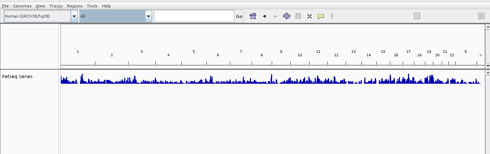
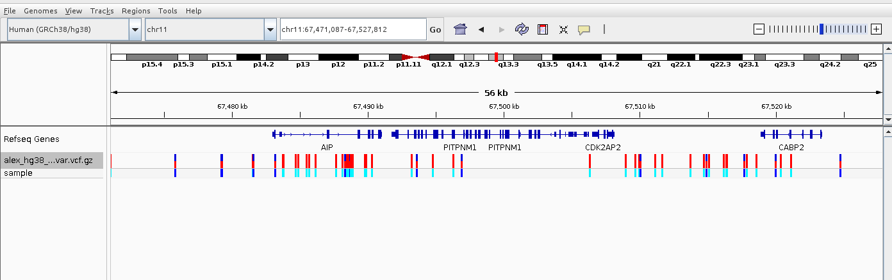
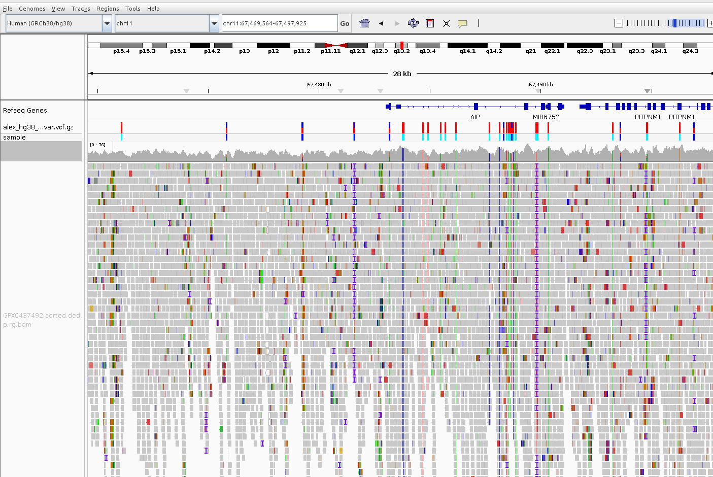
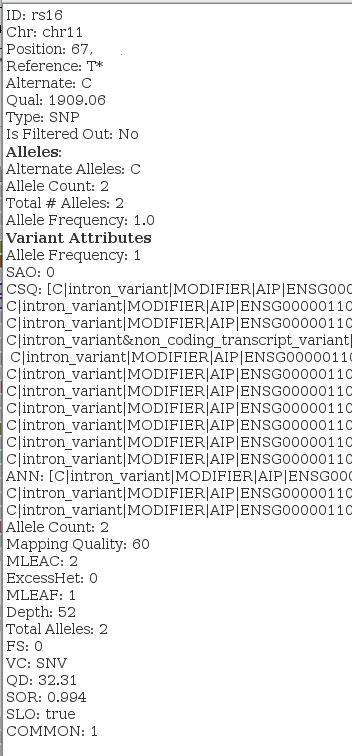

# Genome browsers: a beginner's guide

## Intro
This intro is not intened for professional who definitelly know how and why they need a genome browser. This article is for those who just started or may be a person who just did a consumer genomic sequensing in companies similar to 23andme and wants to look a bit deeper into data then looking throug simple text reports they provided.
So, lets say you are a curios person who desided to explore what is underhood of text cunsumer genomics report, you downloaded your own data from uour personal online cabinet and ... what next?

## Why you might need a genome browser?
First of all, the typical result of processed whole genome sequencing (WGS) is annotated VCF file, i.e. all mutations up to 50bp. The typical size of WGS human file is in a range of 1G - 2G depending on annotation. 
Often it is also usefull to use a BAM file which provides information about coverage of each mutation. The size of BAM file is about 40G (if the sequencing was done with 40x coverage).

To make sence of such a huge amount data one definitelly need some kind of tool. One of such tool is a genome browser

## Which genome browsers exists?

- IVG ((Integrative Genomics Viewer))
- Ensembl Genome Browser
- UCSC Genome Browser
- NCBI Genome Data Viewer (GDV)

In this review we will mostly explain IGV because amoung all four above it is the only one which might work locally, so you might avoid uploading your genome online to somebody's server which is both unsequre and might take long time taking the genome size mentioned above.

## IGV genome browser
when you start it first time it looks a bit empty, like this

it only have the neme of genome reference (see genome reference article), GRCh38 in the upper left corner, names of chromosomes 1-22, X, Y and "RefSeq Genes" window which is supposed to show simple gene annotation, i.e. indicate a range which is occupied by each gene, but because in human genome we have ~19k protein coding genes on a whole genome scale we can just see a distribution of number of genes by chromosomes.

The next thing we need to do is load our VCF file with mutations, File->Load from file and choose our VCF file on our local machine.
Almost nothing will be changed and in order to see the actual mutations we need to select a certain chromosome and then zoom in till be see actual mutations along with gene annotation

Now we can upload BAM file and see what is coverage of a certain region so we can uderstand certainty

Note that in order to IGV correctly display both VCF and BAM file they need to be indexed by tabix and have accompanied .tbi file. 

TBD: explain coverage

And the last step would be to double click on any mutation

## Ensembl Genome Browser

