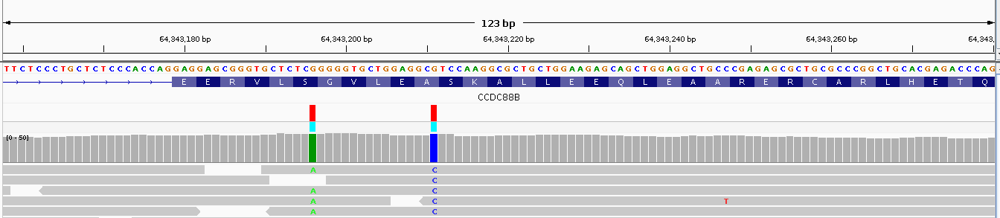
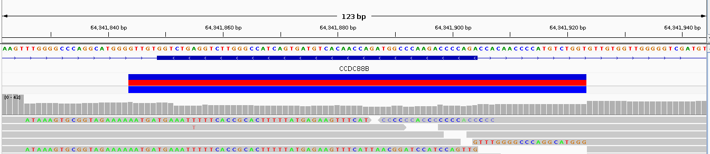

# Understanding Genetic Variations: SNPs, Indels, Structural Variations, and CNVs

(A Small Guide to Interpreting Your Genetic Data)

Genetic variations are differences in DNA sequences among individuals, influencing everything from physical traits to disease susceptibility. Typically, when people refer to genetic variations, they are not discussing differences between random individuals, but rather the differences between the universal reference genome assembly and the genome of an individual person.

These variations can be broadly categorized into several types:
- Single Nucleotide Polymorphisms or Variations (SNPs, SNVs)
- Insertions and Deletions (Indels)
- Structural Variations
- Copy Number Variations (CNVs)

# Single Nucleotide Polymorphisms (SNPs or SNVs)

Single Nucleotide Polymorphisms, or SNPs (pronounced "snips"), are the most common type of genetic variation. They occur when a single nucleotide in the genome is altered. For example, a SNP might change a DNA sequence from A**A**GGCT to A**T**GGCT. These variations can be benign, harmful, or have no effect at all. SNPs are often used in genetic studies to identify associations with diseases, traits, and responses to medications.

It’s worth mentioning that a single mutation (SNP) very rarely causes a disease. Most diseases are caused by mutations in more than one gene; i.e., they are polygenic. The exceptions are the so-called Mendelian diseases.

There are not many of them, and most Mendelian diseases are collected in the OMIM database.
OMIM (Online Mendelian Inheritance in Man) is a regularly updated, online database established in 1997 by Dr. Victor A. McKusick that focuses on inherited genetic diseases in humans. OMIM reports around ~400 human genes of known sequence with a known phenotype, and approximately ~2,000 human phenotypes with a known molecular basis.

Again, most serious conditions are polygenic, and drawing conclusions about them is much more complex. To add a comlexity on top of that it is worth mentioning that the environment often interacts with these polygenic traits as well, making the understanding and prediction of such diseases even more complex.

SNPs are usually inferred (called) from aligned raw NGS data by so-called **variant callers** like GATK or FreeBayes, and the results are included in the final VCF file.

## Insertions and Deletions (Indels)

Indels refer to the insertion or deletion of small DNA sequences in the genome. Generally, insertions and deletions up to 50 base pairs (bp) are considered indels; anything larger is typically referred to as a **structural variant**.

Indels can have a significant impact on genes and proteins, potentially causing frameshift mutations that alter the reading frame of a gene. This can lead to changes in protein function, which might result in disease.

Indels are also identified using the variant callers mentioned above, such as GATK and FreeBayes.

In a VCF file, an indel is represented in the ALT field, where the alternative allele shows the insertion (e.g., A becomes ATC) or deletion (e.g., ATC becomes A).

## Large structural variations

### Structural variants (SV)

The difference between SNPs, indels, and structural variants lies in the scale and type of genetic change:
- SNPs involve a change of just one nucleotide in the DNA sequence, like a single base pair substitution.
- Indels involve insertions or deletions up to 50 base pairs (bp).
- Structural variants are larger than 50bp and can include duplications, inversions, and translocations.

So, SNPs and indels are small-scale changes, while structural variants represent larger, more complex alterations in the genome.

The main types of structural variations include:
- Deletions: Loss of a DNA segment, which can remove one or more genes.
- Duplications: Replication of a DNA segment, leading to multiple copies of genes.
- Inversions: Reversal of the orientation of a DNA segment.
- Translocations: Transfer of a DNA segment from one chromosome to another, which can disrupt gene function at both ends of the translocated segment.
- Complex Rearrangements: Combinations of multiple structural variations that can result in highly altered genomic regions but these can often be challenging to detect and interpret due to their complexity.

Structural variants can be represented in a VCF file, typically using the SVTYPE INFO field to describe the type of structural variant (e.g., DEL for deletions, DUP for duplications).

Additionally, BED files may be used to describe the genomic intervals affected by SVs.

### Copy Number Variations (CNVs)
Copy number variations are type of structural variant where a segment of the genome is present in more or fewer copies than the normal two copies (one from each parent). 

Types of CNVs:
- Amplifications: Increase in the number of copies of a genomic segment.
- Deletions: Loss of one or more copies of a genomic segment.

CNVs are structural variants, but they specifically affect large segments of the genome, ranging from kilobases to megabases (i.e., from 1,000 base pairs to a substantial part of a chromosome).

CNVs can lead to an increased or decreased dosage of the genes within the affected regions, influencing gene expression and potentially contributing to various diseases, including cancer and developmental disorders.

Popular CNV Callers:
- GATK4: Includes a module specifically for detecting CNVs, both gains and losses, outputting results in VCF format.
- CNVnator: A tool designed for CNV discovery using read depth from next-generation sequencing (NGS) data, outputting data in BED format.
- EXCAVATOR2: Tailored for detecting CNVs in whole-exome sequencing (WES), with output in BED format.

CNV callers typically start to work accurately from approximately 1,000bp and provide their results as BED files, which describe the locations and types of CNVs.

CNVs are often implicated in various genetic disorders, including developmental delays, intellectual disabilities, and cancer. Understanding a patient's CNV profile can guide treatment decisions, particularly in oncology, where certain CNVs are associated with prognosis and response to therapy.

It is not common to analyze CNVs in consumer genetic testing; the primary application area for CNV analysis is in cancer biopsies, where detecting somatic mutations can help tailor appropriate treatments.

# Conclusion
Genetic variations, including SNPs, indels, structural variations, and CNVs, play a crucial role in understanding human health and disease. While consumer genetic testing primarily focuses on smaller-scale variations like SNPs and indels, larger structural variants and CNVs are more commonly analyzed in clinical settings, particularly in oncology. Understanding the different types of genetic variations and their implications can provide valuable insights into disease predisposition, diagnosis, and personalized treatment strategies.

