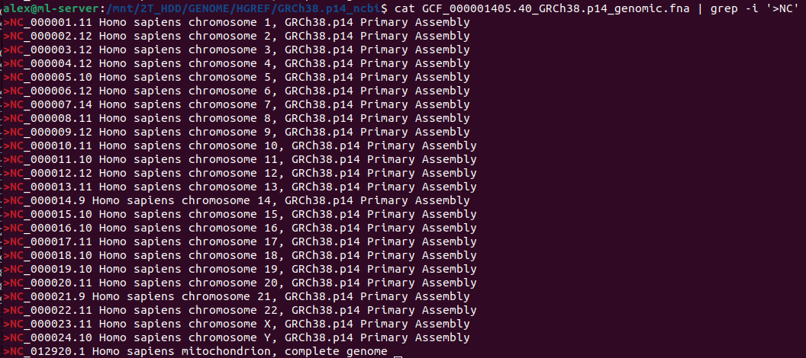

# Reference genomes: NCBI, UCSC and EMBL notations

The goal of genetic sequencing is to determine how an individual's genome differs from a standard genome, identifying all genetic variations. However, there is no true standard genome, so the choice is somewhat arbitrary.

In 1997, thirteen volunteers from New York donated their blood for the first-ever human genome sequencing. This effort led to the creation of the first reference genome (reference assembly) through the Human Genome Project (HGP), completed in April 2003.

Since then, the reference genome has been regularly refined, resulting in several releases and a somewhat confusing nomenclature. Let's clarify it.

You might hear about GRChXX or hgXX references. Although they refer to the same underlying genome assembly, there are slight differences for historical reasons.

This redundancy exists because multiple organizations have taken on the responsibility of maintaining their own genome references:

    - NCBI (National Center for Biotechnology Information), USA
    - UCSC (University of California, Santa Cruz), USA
    - Ensembl / EBI, European Union

Each organization updates and manages its reference genomes, leading to different naming conventions and slight variations in their assemblies.

## NCBI
The National Center for Biotechnology Information (NCBI) in the US provides comprehensive genome sequences and annotations through the Genome Reference Consortium (GRC). This is why their reference genomes have names like GRCh38. NCBI focuses on ensuring that the genome assembly is as complete and accurate as possible.

You can download their reference genomes here ( https://www.ncbi.nlm.nih.gov/genome/guide/human/).

## UCSC

The University of California, Santa Cruz (UCSC) is renowned for its online genome browser, the UCSC Genome Browser. UCSC played a significant role in the Genome Reference Consortium (GRC) and actively contributed to the NCBI's effort to create a standard reference genome. They developed their own genome browser and, for reasons of their own, use a different naming convention for the reference genome within this browser, prefixing it with "hg" (human genome), such as hg19. Although it is essentially the same reference, the UCSC version has very subtle differences and richer genome annotations (e.g., marking the start and end of genes, splicing information, etc.). Due to the browser's popularity, the "hgXX" names have also become widely used.

You can download their reference genomes here: https://genome-euro.ucsc.edu/cgi-bin/hgGateway?redirect=manual&source=genome.ucsc.edu

Below is a table showing how the NCBI and UCSC references match up, highlighting the somewhat messy nomenclature.

|   NCBI name        | UCSC name    |   EMBL name  |   Release Date    |  
|--------------------|--------------|--------------|-------------------|
| T2T-CHM13          |  hs1         |              | January 2022      |
| GRCh38             |  hg38        |    GRCh38    | Dec 2013          |
| GRCh37             |  hg19        |    GRCh37    | Feb 2009          |  
| NCBI Build 36.1    |  hg18        |              | Mar 2006          |
| NCBI Build 35      |  hg17        |              | May 2004          |
| NCBI Build 34      |  hg16        |              | Jul 2003          |

Each reference genome uses a different chromosome naming convention, which makes them incompatible at the bioinformatics tool level. Therefore, it's important to stick to a single convention. For example, if raw files were aligned with hg19, you cannot run genome annotation using the GRCh37 reference, even though they are essentially the same.
Here are the corresponding chromosome names:

|   NCBI chr name    | UCSC chr name  | EMBL chr name  | 
|--------------------|----------------|----------------|
|    NC_000001.1     |   chr1, chr2   |     1,2,3      |

But this is not the whole story; Europe is involved too.

## EMBL and Ensembl
The European Bioinformatics Institute (EMBL-EBI) is a European organization responsible for providing comprehensive genome sequences and annotations. They have developed their own genome browser, Ensembl, which is known for its detailed and rich annotations. Ensembl includes extensive gene predictions, comparative genomics data, regulatory elements, and variation data. The Ensembl reference genome is also called GRChXX but has slight differences from the NCBI and UCSC references, adding to the overall complexity.

One of the challenges is that all three organizations use different chromosome names, making cross-annotation difficult. This discrepancy complicates the integration and comparison of data across different references.

Below is a table illustrating the differences in chromosome naming conventions among NCBI, UCSC, and EMBL.
|   NCBI chr name        | UCSC chr name    |   EMBL chr name  |
|------------------------|------------------|------------------|
|  NC_000001.1           |    chr1, chr2    |  1,2,3           |

EMBL-EBI can be downloaded here
https://ftp.ensembl.org/pub/release-112/fasta/homo_sapiens/dna/

## Example of each reference

Here we illustrate the differences among the three references by comparing the names of chromosomes used in each reference:

## T2T consortium

### Centromers
The initial sequencing efforts were able to sequence approximately 92% of the DNA found in human cells. Certain regions in human chromosomes are particularly challenging to sequence, namely the centromeres and telomeres.

Centromeres are located in the middle of a chromosome and ensure the proper segregation of chromosomes during cell division. They look like this:

Centromeres consist of long arrays of repetitive DNA sequences, known as satellite DNA, making them very hard to sequence. Sequencing technologies, especially those based on short reads, struggle to accurately map and assemble these repetitive regions. As a result, these regions often appear with gaps or no variants, depicted as follows:

### Telomers
Telomeres are located at the very ends of chromosomes and consist of repetitive nucleotide sequences, typically TTAGGG repeated thousands of times. Telomeres protect the ends of chromosomes from deterioration and signal the cell to stop dividing when they become too short, a process associated with aging and cellular senescence.

Telomeres are also repetitive so very hard to accemble by short read requencers

As of May 2020, the Genome Reference Consortium (GRC) reported 79 "unresolved" gaps, accounting for up to 5% of the human genome .

In 2021, it was reported that the Telomere-to-Telomere (T2T) consortium had filled in all of the gaps except five in repetitive regions of ribosomal DNA.

## Conclusion

So, which genome reference should you use? It depends on several factors.

Firstly, the utility of a reference genome is enhanced when it is accompanied by robust gene annotations and linked to mutation databases, which are typically closely tied to a specific reference assembly. For example, chromosome naming conventions must align.

Secondly, the data you have might already be linked to a specific reference. For instance, if you download your own VCF file from services like 23andMe, this file of personal mutations is already associated with a particular reference, so you have no choice but to use that exact reference assembly for subsequent analysis.

For the same reason, using the T2T reference isn't always the best choice currently, because most mutation databases have yet to release versions linked to this T2T reference, limiting the scope of subsequent analysis.

Understanding these nuances helps in making informed decisions about which genome reference to use, ensuring compatibility and maximizing the usefulness of your genetic data.

