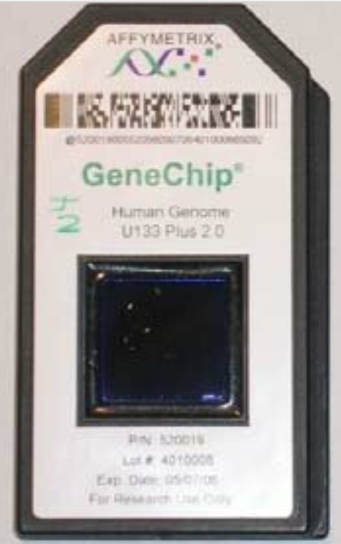
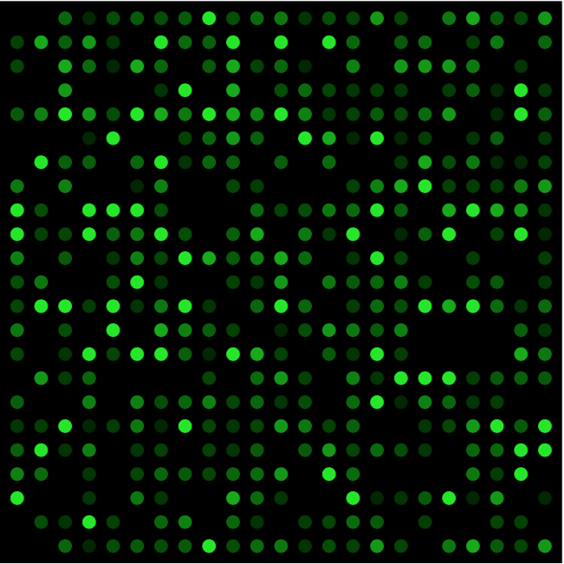
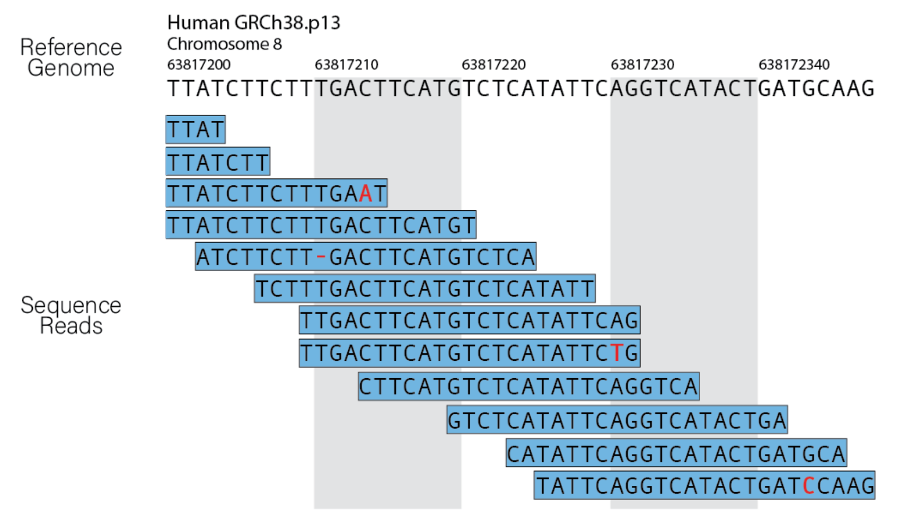

# Consumer Genetics Overview

## Introduction
Consumer genetics has gained popularity over the past decade due to significant progress in NGS sequencing. Modern sequencer machines like those from Illumina provide relatively inexpensive short-read DNA sequencing, currently priced around $300.
 
From a consumer's perspective, it works like this: a consumer genetics company requests a sample of your saliva or blood, then performs NGS short-read sequencing or alternatively applies microarray technology. After a while, the company provides you with several basic reports (fitness, wellness, pharmacogenomics, etc.), along with the raw and processed mutation data (FASTQ, BAM, VCF) uploaded to your password-protected area on their website.

You can request more reports, but this costs extra. Often, a subscription is required, so the initial cost might be doubled. Each company might have a slightly different focus: some may focus on ancestry, while others concentrate on genomic predisposition reports. Ancestry analysis is a bit more complicated, as it requires collecting a large number of samples from people in different regions. To do it precisely, it is also necessary to sequence the genome of at least one of your close relatives to perform genome phasing, which determines to which chromosome a particular mutation belongs.

## Technical Considerations When Choosing a Consumer Genomics Company

All companies may appear similar, but the devil is in the details. Usually, the final result of sequencing is a VCF file containing all detected mutations. This file can be generated using different technologies, namely microarray or short-read NGS. The difference is quite important.

Microarray is a cheaper option and essentially a plate with a limited number of DNA probes that bind (hybridize) to a DNA sample. If there is a match, a dot can be detected, indicating that a particular mutation is present in the DNA sample. As you can infer from this description, microarray can only detect known mutations (SNPs, indels, etc.), and the list of those mutations tends to be outdated and lag behind current databases.

In contrast, NGS technology literally scans the whole genome (WGS) or exome (WES) for all mutations and you can always re-annotate your VCF file with the latest updates from clinical and other databases. For more information about NGS, see this article (link).

WGS companies also provide you with so-called RAW read data, allowing you to not only re-annotate your data with recent databases later on but also re-align your genome to a new reference, which usually happens once in a decade with a more precise reference genome.

## What You Can Get from Sequencing Your Genome: Reports

This is usually the main question: why do I need it, and what can I do with it? Companies typically provide reports like:

- Medical reports
- Fitness
- Wellness
- Pharmacogenomics

(insert 4 pictures here)

For medical reports, your mutations are checked against databases such as ClinVar, OMIM, and others, which contain associations with diseases. This allows the company to inform you if people with your genetic profile are likely to have a predisposition for certain conditions.

If you have a predisposition to any diseases, they will notify you. It's important to approach these medical reports with some skepticism. Only a limited number of diseases are clearly linked to genetics. These are usually caused by specific mutations in one or several genes, making these genes dysfunctional and causing disease. Such diseases are called Mendelian, with sickle cell anemia being a well-known example. In contrast, most common diseases have a weaker genetic link, meaning the connection between genes and diseases is not certain (just associated) and scientists use statistics to associate these diseases with a number of genes. It works like this: if 100 people have a disease and a certain mutation is overrepresented in their population, it means that these mutations have some degree of association with that disease. So, if those mutations are found in someone's genome, they add up to a risk of having this disease but do not guarantee it.

Before considering a variant as harmful, one must consider many other factors, such as allele frequency in the population. So, don't panic if you find a harmful variant in your report.

Why might this information still be useful? In some cases, it might motivate someone to change their lifestyle. For example, if someone has a predisposition to respiratory disease, it might help them quit smoking. In other cases, it might help make a better diagnosis, but one must be careful here. Due to the statistical nature of NGS, there might be artifacts, so for medical purposes, it is imperative to confirm NGS results with more precise Sanger sequencing.

For fitness, the report might indicate: People with your genetic profile are likely to have a good starting sprint.

Basically, it shows in which sport activities you can achieve significant results based on genetic variants. This test might be useful if you plan a sports career or simply want to understand your body better.

Pharmacogenomics reports show possible side effects and adverse reactions to different medications.

## What You Can Get Out of It: Ancestry
(insert a picture here)

Another important piece of information that can be extracted from your genome is your personal ancestry. This can be viewed from two different angles. First, your personal ancestry: who are your distant relatives? Perhaps you have relatives you don't even know about.

The second angle is determining the regions of the world your ancestors came from. Are you a distant descendant of Vikings or Roman conquerors?

Ancestry is more complex than mutation reports, and not all companies can provide the necessary precision and scale. Usually, this requires a separate type of company that collects as many samples as possible, creates its own database, and then looks into this database to find someone closely related to you.

Defining a population's ancestry involves collecting genetic samples from people who have lived in rural areas for a long time. This helps ensure they represent a stable population. Sequencing people living in big cities isn't as effective because they likely moved there within the last 100 years and could originate from entirely different places. Based on this data, specific "haplotypes" are defined and linked to the regions they came from. If such a haplotype is found in your genome, it means one of your ancestors originated from a very specific place. These haplotypes are stored in open databases.

Another issue is that the process of sequence analysis is more complicated. Ancestry is determined using haplogroups, which are genomic regions inherited together. Due to recombination, parents' genomes mix in by chunks, so direct relatives will have many similar haplogroups aka chunks of sequence. However, the farther back you go in ancestry, the fewer haplogroups will be in common. For certain communities, there are several haplogroups; if you have them, you belong to that population.

Using haplogroups requires more sophisticated analysis. In contrast to SNP detection, which identifies the variations at certain loci, haplogroup analysis requires understanding the same regions across each chromosome.

The result of ansestry analysis ,ight be delivered in several ways.