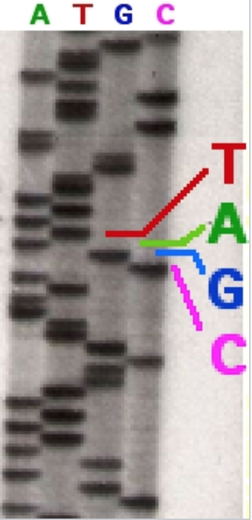
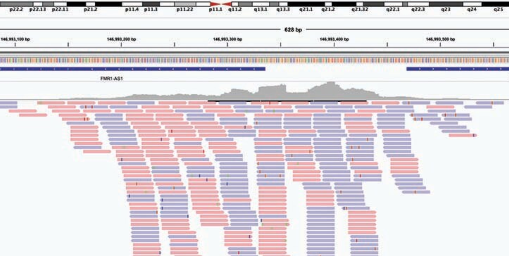

# TOC
Glossary:
- NGS vs First generation sequencing.
- SNPs Indels, CNV
- VCF file, variant calling

- Reference genome, hg37, hg38
- raw read data, FASTQ file
- WGS, WES, microarray
- genomic alignment
- haplogroup, haplotype, phasing
- locus
- chromosome
- short read sequensing vs long read sequencing
- annotations in context of VCF, dbSNP, ClinVar
- mendelian vs poligenic diseases
- genetic variant databases, ClinVar, OMIM etc
- phasing

#  DNA, First generation sequencing,  Next Generation Sequencing

To provide context for those unfamiliar with molecular biology, DNA is a crucial biological molecule found in the nucleus of every human cell. It encodes the instructions for producing other molecules (namely proteins) within the cell, specifying their order and the conditions under which they are produced. In other words, DNA serves as a universal software and data guide for biological processes in the cell.

It's important to note that DNA does not reflect the current state of the biological system but rather serves as a "code base" for all possible options. Each cell in the body contains identical DNA, so knowing a person's DNA code cannot provide definitive information about whether a person has a disease, its possible progression, etc. DNA is not used for diagnostics but rather for understanding the potential for certain conditions.

Nevertheless, a person's DNA is a valuable source of information, and various techniques exist to decipher it from a sample.

DNA sequencing technologies have revolutionized genomics and molecular biology. There are two major technologies behind sequencing: First-Generation Sequencing (also known as Sanger sequencing) and Next-Generation Sequencing (NGS), each with distinct processes and applications.

As the name suggests, First-Generation Sequencing was developed earlier. It is labor-intensive but highly precise. Due to its accuracy, it is still used today in scenarios requiring precise certainty, such as confirming a mutation for clinical diagnosis or in forensic science, where it is crucial to know if a mutation exists. Whenever you see an image like the one below, it typically pertains to Sanger first-generation sequencing (courtesy of Wikipedia).

Although now somewhat automated, it remains a slow and labor-intensive process.

Due to its laborious nature, it is impractical to check many mutations simultaneously, so Next-Generation Sequencing (NGS) is used for large-scale sequencing.

Without delving deeply into the technology, the process involves cutting long DNA molecules into short pieces, usually 200-250 nucleotides (nt) long. Each piece is then sequenced separately, and the final results are obtained as millions of short sequences (raw reads). These reads are aligned to a reference genome and undergo further bioinformatics processing to generate a Whole Genome Sequence (WGS) or Whole Exome Sequence (WES). Alignments of raw reads look like the following:

As a result of NGS, one can finally obtain a VCF (Variant Call Format) file, which represents all of a person's mutations compared to a reference genome.
