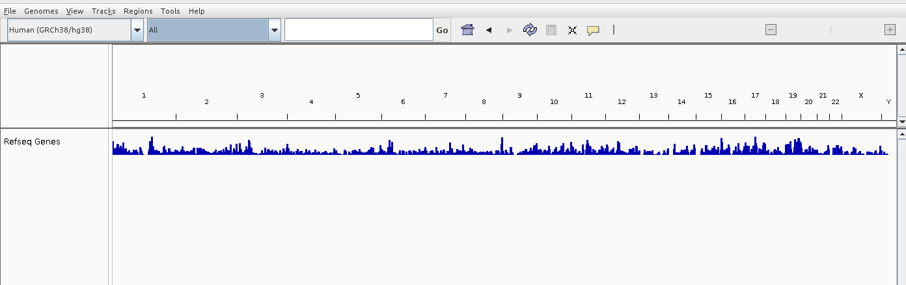
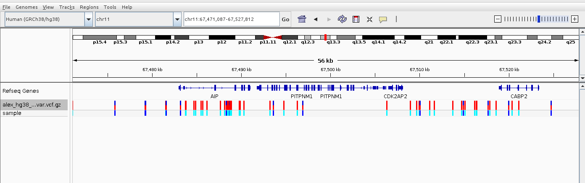
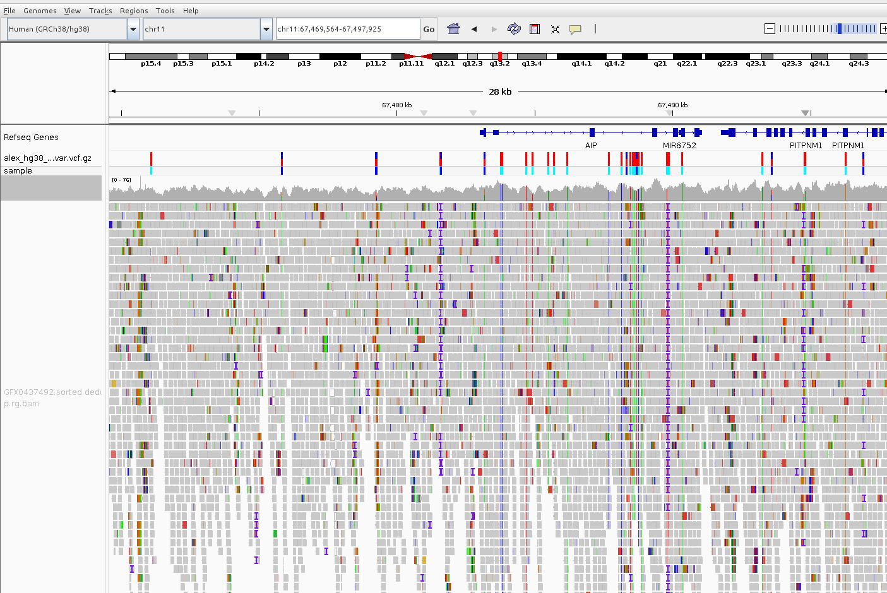
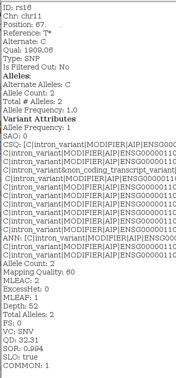

# The Integrative Genomics Viewer (IGV) genome browser

The Integrative Genomics Viewer (IGV) is a genome browser from Broad Insitute (Broad Institute of MIT and Harvard, a biomedical and genomic research center located in Cambridge, Massachusetts, United States).

It is one of the most popular offline vizualization tool for exploring Next Generatio (NGS) data.

It this post I will try to give a small unofficial guide how to start with it and what are the main features. 

## Installation

IGV is a Java application, so Java also must be installed on your computer.
IGV can be downloaded from their site https://igv.org/doc/desktop/.

## First look
When you start it first time it looks a bit empty, like this

At the beginning you only can see the name of genome reference (see genome reference article - https://offsiteteam.com/blog/reference-genomes_ncbi-ucsc-embl-notations) (GRCh38) in the upper left corner, then names of chromosome (1-22, X, Y) and "RefSeq Genes" window which is supposed to show simple gene annotation, i.e. indicate a range which is occupied by each gene, but because in human genome we have ~19k protein coding genes on a whole genome scale we can just see a distribution of number of genes by chromosomes.

## Loading your data
The next thing we have to do is to load our VCF file with mutations, lets go File->Load from file and choose our VCF file on our local machine.
Almost nothing will be changed and in order to see the actual mutations we need to select a certain chromosome and then zoom in till be see actual mutations along with gene annotation

Now we can upload BAM file and see what is an exact coverage of an every region so we can uderstand certainty behind each mutation.

Note that in order to IGV correctly display both VCF and BAM file they need to be indexed by tabix and have accompanied .tbi file. 

Why do we need this BAM file with coverage (depth)? To make it cler we nned a short excurse into how NGS works. The point is the NGS works like that: the DNA strand under investigation is cut in pieces of approximatelly 250 bp, then each piece is sequenced and they all are collected together in so called raw data file, i.e gigantic fastq file where all those short sequences are just piles one after another. 
Then an algorithm called genome aligner is run over all these short reads and aligh them to a reference genome and you can see that alignment in BAM file on the picture above.
The more "pile" under a certain utation the more confident we are about that mutation, it is said the mutation has 40x coverage for example.

## Exploring individual mutations
But lets go back to IGV genome browser. After loading our VCF and BAM files the next step would be to double click on any mutation

Lets explore a bit this information about each mutation.
You can read this fields as follows
- ID: this is socalled rs-id, a unique identifier of each mutation. Be carefull, this id is specifically linked to a genome reference you have aligned your genome. Those ids are collected in a dataabse called dbSNP and updated every years, so it is crusial to re-annotate your vcf file once in a while
- Ch/Position: it is a chromosome numner and a position in this chromosome of your mutation
- Reference / Althernate: this is a mutation itself. It this particular case the reference is T but your genome in question has A on this position, so this is SNP (single nucleotode polymorphism)
- Qual: this is a quality assigned to every position, QUAL scores above 20-30 are typically considered confident. 1909 is a very confident value. Technicaly the QUAL score is usually calculated as a Phred-scaled probability that the observed variant is a false positive. For example, a QUAL score of 30 would indicate that there's a 1 in 1000 (0.1%) chance that the variant is incorrect, because:
- Type: migth be SNP (single nucleotide polymorphism), ...
- Is Filtered Out: this is a filed set by Variant caller and might be PASS, LowQual etc. Once variants are identified, the variant caller applies certain quality filters to assess whether the identified variant meets the desired confidence level, and then populates the FILTER field accordingly.
Based on these metrics, the variant caller assigns a value to the FILTER field:
    - PASS: If the variant passes all the filtering criteria.
    - Specific filter names (like LowQual) if the variant fails certain quality thresholds.
    - . (dot) if no filters are applied.

### Alleles block. 
It contains several fileds Allele counts, althernative allele and allele frequency. If reads aligned to s certain position of the reference contains different nucleotides it is said that that position has althernative alleles. Those alleleles might be because of sequencing errors or because they are really present in the sample genome. To make it clear we have AF (allele frequencey) filed. The Allele Frequency (AF) field in a VCF file represents the proportion of sequencing reads that support the alternative (variant) allele compared to the total number of reads covering that position in the genome.
  - Allele Frequency = 1 means that 100% of the reads covering the variant position in the genome support the alternative allele. There are no reads supporting the reference allele. That usually means that an individual has an althernative nucleotide (to a reference) on both chromosomes. This individual is homozygous
  - AF=0.5 means that one chromosome conains a ferefernce value and another is mutated. This individual is heterozygous

AF = 0.25, 0.75, or other values: These values can occur, but they are less common in a standard diploid organism (where each person has two copies of each chromosome). When you see allele frequencies like 0.25 or 0.75, these can result from special circumstances, such as:

- Mosaicism: This occurs when not all the cells in an individual have the same genetic makeup. Some cells may carry the mutation, while others do not. This can lead to an allele frequency that is neither 0.5 nor 1, depending on the proportion of cells with the mutation.
- Somatic Mutations: In cancer or other diseases, some tissues might acquire mutations that are not present in every cell of the body. For example, a tumor sample may have a mutation present in only a subset of cells, leading to an AF between 0 and 1 (e.g., 0.25 or 0.75).
- Copy Number Variations (CNVs): In cases where a region of the genome is duplicated or deleted (copy number variation), the allele frequency can deviate from the expected 0.5 or 1. For example, if you have a duplication of a region with three copies of a gene, and two copies carry the reference allele while one copy carries the alternative allele, the allele frequency might be around 0.33.
  

### Variant attributes block.
After variant calling and having VCF file with all mutations the next step is usually annotation of those mutations.
It is usually done with ngs annotations tools and the most popular such tools are VEP, Annovar and SnpEff. 

Describing these tools is out of scope of this post but I would just say that each of the tools above will add a specific INFO section to each variant in VCF file and those sections will be shown in Variant Attributes block by IGV.
As we can see in our case we have a CSQ (which means Consequence) block which was added by VEP. SnpEff adds the same infrmation under ANN tag. Also some other tags might be added like IMPACT etc.

In our case of CSQ block we can see every mutation annotated with possible consequnces, usually divided by different transcript with corresponded Ensemble ID. The consequence on a  sertain transcrpit are divided into several cathegories
- High Impact: transcript ablation, frameshift, stop loss etc
- Moderate Impact: Missense variant, Inframe insertion, Protein altering etc
- Low Impact: Synonymous variant, Start retained_variant etc

