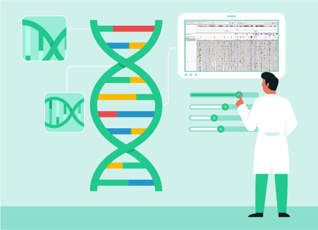
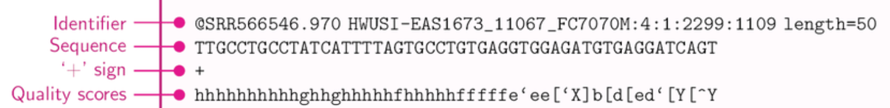

# The Integrative Genomics Viewer (IGV) Genome Browser
The Integrative Genomics Viewer (IGV) is a powerful visualization tool for Next Generation Sequencing (NGS) data developed by the Broad Institute (the Broad Institute of MIT and Harvard, a leading biomedical and genomic research center based in Cambridge, Massachusetts, USA).

It is one of the most popular offline genome browsers for exploring Next Generation Sequence (NGS) data.

However, since browsers like IGV are typically designed for expert users, they often lack user-friendly interfaces, making it difficult to get started. This post aims to bridge that gap by providing an easy-to-follow guide for using the IGV browser and tips on how to interpret mutation annotations.

## Installation
IGV is a Java-based application, so you'll need to have Java installed on your computer beforehand.

You can download IGV directly from their official website at https://igv.org/doc/desktop/ and install it locally.

## First Look

When you first launch IGV, the interface may look a bit empty, like this:

Upon startup, you can see the current [genome reference](https://offsiteteam.com/blog/reference-genomes_ncbi-ucsc-embl-notations) (GRCh38) in the upper left corner, along with the names of chromosomes (1-22, X, Y). There's also a "RefSeq Genes" window, which is meant to show simple gene annotations, indicating the range occupied by each gene.

To view these gene annotations, you need to zoom in first. This is because the human genome contains approximately 19,000 protein-coding genes, and at the whole-genome scale, you can only see the distribution of genes by chromosome. Zooming in will reveal more detailed information.

You can choose another reference genome, such as GRCh37, or even load your own specific reference FASTA file. However, be aware that if you use your own assembly, some features like searching by gene name may not work correctly. It's often better to use IGV's internal references for smoother functionality.

## Loading Your Own Genome Data

Now it’s time to load your own VCF file containing mutations. Navigate to "File -> Load from File" and select your VCF file from your local machine.

At first, nothing much will change on the screen. To view the actual mutations, you'll need to select a specific chromosome and then zoom in (using the controls in the upper left corner) until the mutations become visible alongside the gene annotations.

Next, you can upload a BAM file to examine the coverage of each region, helping you assess the certainty of each mutation. But before we dive into that, let’s briefly review what a BAM file is and why it’s important.

## A Quick Overview of NGS Sequencing

In short, NGS (Next Generation Sequencing) works by cutting the DNA strand under investigation into fragments of roughly 250 base pairs. Each fragment is sequenced, and all the data is combined into a raw data file, a large FASTQ file where these short sequences are piled up one after another.

After sequencing, a genome aligner algorithm takes these short reads and aligns them to a reference genome, creating a BAM file. The more reads that "pile up" under a certain mutation, the more confident we are about that mutation. For example, a mutation might be said to have 40x coverage, meaning it’s supported by 40 reads.

A BAM file describes genome intervals, which in this case are raw reads from the sequencer and how they map to the reference genome. With this information, IGV can calculate and visualize the exact coverage (or sequencing depth) for every mutation in the VCF file. The depth is shown as a pile of reads at each genome position.

Note that for IGV to correctly display both VCF and BAM files, they need to be indexed with Tabix and have accompanying .tbi files. Without this index, some features will silently fail to work, which can lead to a lot of frustration and wasted time trying to figure out why.

## Exploring individual mutations
After loading the VCF and BAM files, the next step is to double-click on any mutation to view detailed information about it in the following window:

Let’s now break down this information and explore what each field means.

### General Information Provided by the Variant Caller
- ID: This is the so-called rsID, a unique identifier for each mutation. Be cautious, as this ID is specific to the genome reference you’ve aligned your genome with. These IDs are collected in a database called dbSNP and are updated regularly. It’s crucial to re-annotate your VCF file occasionally to keep the IDs up to date.

- Ch/Position: This shows the chromosome number and the position on that chromosome where your mutation is located.
  
- Reference / Althernate: This is the mutation itself. In this particular case, the reference base is T, but in your genome, the position has an A, indicating a SNP (single nucleotide polymorphism).

- Qual: This field represents the quality score assigned to the position. QUAL scores above 20–30 are typically considered reliable, and a score of 1909 is extremely confident. Technically, the QUAL score is usually calculated as a Phred-scaled probability that the observed variant is a false positive. For instance, a QUAL score of 30 suggests there is a 1 in 1000 (0.1%) chance that the variant is incorrect, because:
Phred score=−10log_10(P_error)

- Type: Indicates the type of mutation, such as SNP (single nucleotide polymorphism), indel, etc.

- Is Filtered Out: This field, set by the variant caller, indicates whether the mutation passes quality thresholds. The possible values include:
    - PASS: If the variant passes all the filtering criteria.
    - Specific filter names (like LowQual) if the variant fails certain quality thresholds.
    - . (dot) if no filters are applied.
  Once variants are identified, the variant caller applies specific quality filters to determine if the identified variant meets the required confidence level. The FILTER field reflects this assessment.

### Alleles block. 
This section contains several fields: Allele Counts, Alternative Allele, and Allele Frequency. If reads aligned to a certain position on the reference genome contain different nucleotides, it is said that the position has alternative alleles. These alleles could be due to sequencing errors or genuine variations in the sample genome. To clarify this, we use the AF (Allele Frequency) field. The Allele Frequency (AF) in a VCF file represents the proportion of sequencing reads that support the alternative (variant) allele compared to the total number of reads covering that position in the genome.

  - AF = 1: This means that 100% of the reads covering the variant position in the genome support the alternative allele, with no reads supporting the reference allele. This usually indicates that the individual has an alternative nucleotide (compared to the reference) on both chromosomes and is therefore homozygous.
  - AF=0.5: This means that one chromosome contains the reference allele and the other has the mutation, indicating that the individual is heterozygous.

When AF is 0.25, 0.75, or other values, these can occur, but they are less common in standard diploid organisms (where each person has two copies of each chromosome). Such allele frequencies can arise from specific circumstances, including:

Mosaicism: This occurs when not all the cells in an individual have the same genetic makeup. Some cells may carry the mutation, while others do not. This can result in an allele frequency that is neither 0.5 nor 1, depending on the proportion of cells carrying the mutation.

Somatic Mutations: In diseases like cancer, some tissues may acquire mutations that are not present in every cell. For example, a tumor sample may have a mutation present in only a subset of cells, resulting in an AF between 0 and 1 (e.g., 0.25 or 0.75).

Copy Number Variations (CNVs): When a region of the genome is duplicated or deleted, the allele frequency can deviate from the expected 0.5 or 1. For instance, if there’s a duplication of a region with three copies of a gene, and two copies carry the reference allele while one carries the alternative allele, the allele frequency could be around 0.33.

  

### Variant attributes block.
After variant calling and generating a VCF file with all mutations, the next step is typically to annotate these mutations. This is usually done with NGS annotation tools, the most popular being VEP, Annovar, and SnpEff.

While a detailed explanation of these tools is beyond the scope of this post, it’s worth mentioning that each tool adds a specific INFO section to each variant in the VCF file. These sections are displayed in the Variant Attributes block by IGV.

In our example, we see a CSQ (Consequence) block, which was added by VEP. SnpEff provides similar information under the ANN tag. Other tags, such as IMPACT, may also be added.

In the CSQ block, each mutation is annotated with potential consequences, typically categorized by different transcripts, with corresponding Ensembl IDs. The consequences on a certain transcript are grouped into several categories:
- High Impact: Includes transcript ablation, frameshift, stop loss, etc.
- Moderate Impact: Includes missense variants, inframe insertions, protein-altering variants, etc.
- Low Impact: Includes synonymous variants, start retained variants, etc.

# Other Fields
- Mapping Quality (MAPQ attribute): This refers to the quality of alignment (not to be confused with the QUAL field, which measures the quality of variant calling itself!). A value of 60 is considered high confidence, while MAPQ = 20 suggests lower confidence, indicating that the reads may be misaligned.
  
- MLEAC: Maximum Likelihood Expectation of the Allele Count, typically provided by GATK and used in population studies when calling variants in multiple individuals simultaneously. MLEAC represents the most likely number of alternate alleles observed across all individuals in the sample. For example, MLEAC = 2 means exactly two alternate alleles are present. MLEAC = 10 means the maximum likelihood estimate of the alternate allele count is 10 across the population.

## Conclusion
A genome browser like IGV is often the first tool you'll use to visualize and explore your variants, offering a clear, intuitive way to navigate complex genomic data. Once you’ve loaded your VCF and BAM files, IGV helps you see how variants are distributed across the genome, their associated gene regions, and the underlying sequencing depth.

The next crucial step is analyzing these variants—known as variant interpretation—and this is not always an obvious task. It involves assessing the potential biological impact of each variant, which requires the use of additional tools like VEP, Annovar, or SnpEff for annotation. These annotations help determine whether a variant is likely benign or harmful, as well as its relevance in the context of diseases or traits.

While genome browsers give you a strong starting point, successful interpretation demands a deeper understanding of the biological context and further integration of various data sources to draw meaningful conclusions from your genomic information.

