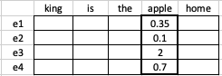
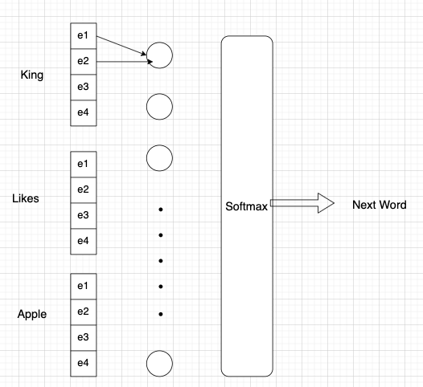

NLP: Embeddings
===============

Intro
-----

In our previous post we have shown how to represent the text as vector of fixed length with Bag of  Words or TF-IDF (Term Frequency - Inverse Document Frequency).

Althore this methods already gave astonished results and was used for decades in NLP they have a fundamental flow in it.  Counting the words and placing them into bags helps us to represent text as a fixed length vector but this vector has nothing to do with meaning of the text. IN fact, the number of words "Rabbit" of course says something about meaning but meaning is much more complicated thing then just a number of words in the text.

Another drawback is that our vectors which represent the text have a very long dimension, usually more then 10000 , which approximately corresponds to a number of words in a language. Such a lenghty vectors  make comparison of two text is hard.

Bottomline, we need a more dense representation and squiize the text into  a vector of  lets say 256.. 512 or 1000 dimensionы and also want this representation to carry more meaning, so when we compute a distance between similar concepts the distance must be small and vice versa.

That dense representation is called embeddings, i.e. the vectior "embed' the meaning in it, so we can easy compute a distance between quine, king and girl and see that the king-girl is greater then between quine-girl.

The methods to compute text embeddings
--------------------------------------

there are several ways to calculate embeddings. One most famous was proposed by (Bengio, 2003) and called Word-to-Vec.

### Word2Vec

Word2Vec: (Bengio, 2003) Word2Vec is a widely used algorithm that learns word embeddings from large text corpora. It utilizes a neural network model to predict the probability of a word given its context.

briefly Bengio proposed the following.
In BoW approach we represent each word as so-called one-hot encoding (see out previous post).

for rxample we can represent word "apple" by setting one across this position in the vector

| king |  is | the  | apple | etc   |
|------|-----|------|-------|-------|
|  0   |  0  |  0   |    1  |    0  |

The idea of the embedding is instead of using 10000 lenght vector of all words, use a vector of smaller size, lets say 256.

How we can learn this shorter vectors?  We can do it with so called "skip gram model".
lets say we are learning an embedding vector for a word "Rabbit". We look for all cases we have a "rabbit" word in a all our texts, then take 6 words before and 6 words after, it is our context.

then take a second random word in this context, let it be "hole"
Now we have a positive training example, rabbit + hole = True, True means that these two words are accisiated because we have seen them together in a text

now we can create many such examples for all words and then buid a neural network which predicts for any two words if they assisiated or no.

One complication is that To train a model we need both types of examples, negative and positive. As from above we have positive, but for get negative examples we could use another technic which is called negative sampling
the main idea is just to generate negative examples by random sampling another word from any words in vocabulary except context.

Let me emphasise the difference between BoW and embedding representation,  
In contrast to BoW, embeddings  are sreated on basis of how often words are met together, so they might mean that they are related to the same context. That is a bif difefernce with BoW

Now lets understand how we can calculate the embeddings themselves

#### way to calculate embeddings with word2vec
( https://doi.org/10.48550/arXiv.1301.3781)

Let us summarize again how our new word representation has to difer from simple BoW. 
We have to represent each word as as vector and vector has to be sharted then BoW vector and the distances between word-vectors have to be proportional to the human reasonon (semantic relationship), i.e. quin and king has to have a small distance, the word-vector big and small has to have large distance then big and medium.

We can learn such a representation of each word as follows.

First, lets imagine we already have that representation, i.e. the lookup table to convert every word into a small vector e1 - e4

Now lest imagine we have many texts in our corpus like that: "King likes the apple, but quin does not"

