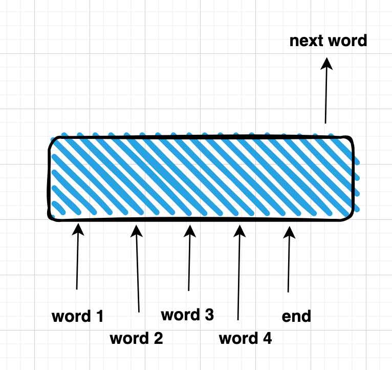
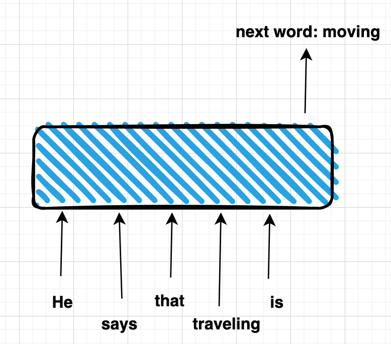
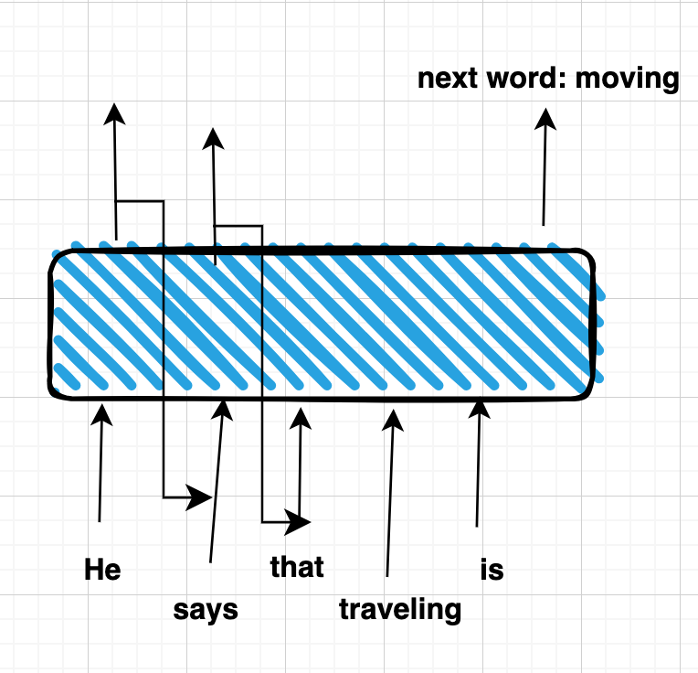

Language Models
===============

Intro
-----
in previous post we understand how to represent text as a vector in a meaningful way with BoW or embeddings, i.e. in such a way that text close to each other by meaning represented by vectors with small distance.

Now the question is that: what NLP can do with those vectors?

Typical NLP tasks are
- next word prediction (sequencing generation)
- sentinent analysis of entire text (deciding if the phsae has positive or negative sentinent)
- NER - named entity recognition, i.e. classifying each word in a text, used for findning for example all Last Names in a text, or all names of genes etc
- 

Language Models for sequence generation
---------------------------------------

Lets take the first task
In order to predict next word we need a language model.

But Why do we ever might need to predict a next word?

Lets figure it out.

### Lets start from defining what is the language model. 

Strictly speaking each language has a different probability of the next word. For example, we can start from the word "Traveling". Apparently the most probable next word migh be "is", so it might be a beginning of a potentilal phrase "Traveling is ...". Of course it depends not only on  the first "Traveling" word but also on what we would like to hear, or what previous conversation was, i.e. on what is called "context". 

This context might be implicit (fs it is often happend in human conversation) or might be defined by the previous paragraph. So in the former case language model will be aware of that context and generate next word accordingly, taking this context into account.

For example, if we ask language model to generate next word not after just "traveling" but like this.
"We have attended a nice presentation of XXX who tried to redefine traveling. He says that traveling ...". In that case the model will exacly know that we are looking for a new definition of traveling and will generate next word accordingly.

If we represent language model as a black box it will look like that

So, what is inside this black box?

RNN as a language model
-----------------------
Recurrent Neural Network is a special Neural Network architecture which helps to deal with sequence data. We will avoid here the detailed desrtiption of of RNN works, we only mention the difference between regular feed-forward NN architecture and RNN.

In a regular feed forward architecture classifier we have something like that

Note, that each word in a  phrase is a separate input and the order of the word does not matter, the model does not account for it in any way. So, we can set input as follows "is He That says travelling" and the output result will be the same. It is perfectly ok for some ML tasks but in case of language changinf the word' order will totally change the meaning. 

To account for that order meaning we create a special class of models which is called sequence models and RNN was one of the furst and widely used. 

The main difference between Feed forward and RNN is clear from that picture

Transformer architecture as a language model
--------------------------------------------

