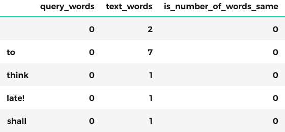
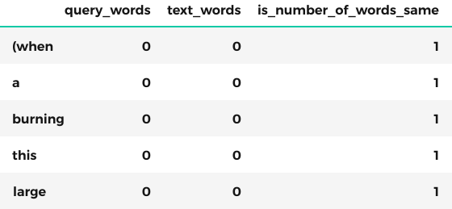
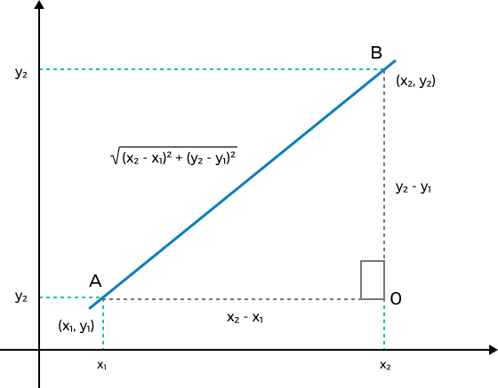
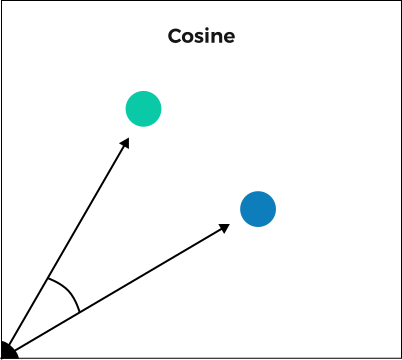

NLP Simplified
==============

Each year, humanity generates an immense volume of knowledge, much of which is typically locked within various forms of text: scientific articles, Wikipedia entries, reports, books, and even handwritten health records. The vast volume of this information makes it nearly impossible to swiftly locate the required data, consequently impeding progress in both scientific and business realms. This forces us to rely on the opinions of a limited number of field experts who invest substantial time in digesting this information, retaining it in their minds for quick retrieval when needed.

Thus, the ability to rapidly access and comprehend extensive textual information is imperative for advancing in the realms of science, business, and even government surveillance. This necessity has given birth to the field of Natural Language Processing (NLP), which serves as a means to enable computers to search, comprehend, and process text written in human language.

The simplest way to represent text to computers: Bag of Words (BoW), text similarity
------------------------------------------------------------------------------------

Traditionally NLP processing relies on very simple technics like BoW (bag of words) or TF-IDF (Term Frequency - Inverse Document Frequency).

Let's say we enter the phrase "Rabbit hole" and want to find the closest text to it (i.e., retrieve a similar document).

On the other side in our database we have many texts like this: "There was nothing so very remarkable in that; nor did Alice think it so very much out of the way to hear the **Rabbit** say to itself, 'Oh dear! Oh dear! I shall be late!' (when she thought it over afterwards, it occurred to her that she ought to have wondered at this, but at the time it all seemed quite natural); but when the **Rabbit** actually took a watch out of its waistcoat-pocket, and looked at it, and then hurried on, Alice started to her feet, for it flashed across her mind that she had never before seen a **rabbit** with either a waistcoat-pocket, or a watch to take out of it, and burning with curiosity, she ran across the field after it, and fortunately was just in time to see it pop down a large **rabbit** -hole under the hedge."

Which texts are similar?
----------------------------

The simplest way to find the most relevant text in our database would be to locate all texts that contain all query words: "Rabbit" and "hole." Not surprisingly, we will encounter numerous texts containing these words. However, determining which one is more relevant to our query poses a challenge. Should we prioritize texts containing five instances of "Rabbit," three instances of "hole," or those containing both?

 To answer this question we have to, first, represent our text for a computer and, finally, find a mathematical way to calculate the similarity between two texts (a distance, in other words)

BoW text representation
-----------------------

The most straightforward method for representing text is referred to as the Bag-of-Words (BoW) approach. 

First, we create a table where, on the left side, we list all possible words in the English language (corpus), and on the right side, we record the number of occurrences of each word in our query or text. For example,

| Query representation | Text_1 representation |
|----------------------|-----------------------|
| rabbit = 1           | rabbit = 4            |
| hole   = 1           | hole = 1              |
| car    = 0           | car = 0               |
| house  = 0           | house = 0             |
| etc ...              |                       |

Those tables are called **vectors** and represent a meaning of the text to some extend. This approach of converting text into a vector is known as the "bag-of-words" approach because it involves processing the text by placing each word into its own "bag," so to speak.

TF-IDF representation
---------------------

TF-IDF (Term Frequency - Inverse Document Frequency) shares the same fundamental concept as BoW but offers greater accuracy. The key idea is that certain words, such as "the" and "is," frequently appear in text but carry limited meaning. These words can skew the distance between texts and essentially convey little information. In TF-IDF, instead of a simple word count, we calculate word frequency using a special formula.
On the contrary, we might encounter a very rare word that appears only once, but it can carry significant meaning. 

Text similarity measures
------------------------

Now we know how to represent a text for computers and we need a way to compare two texts.

So, lets say we created such a bag-of-words vector for each of text in our database and now we have to figure our which text is most close to our query. For that we have to define a distance measure between these two vectors.

The simplest distance is so called **hamming distance**, when we simply count the different values between two vectors

But as we can see it is not quite accurate distance because it does not take into account number of words in a bag.

The better results we can have by using **Euclidean distance**.

To illustrate the Euclidean distance let's imagine our vectors are only of size two (it is called cardinality)

| query	     | Text1	    | Text2       |
|------------|--------------|-------------|
| rabbit = 1 |	rabbit = 4  |  rabbit = 2 |
| hole = 1	 |  hole = 1	|  hole = 1   |

And lets depicts those texts as dots on a 2D plain. We can clearly see that text2 is closer to query then text1.

To define this observation mathematically we can just calculate the length of the line connecting two dots.

You may have observed that even though text2 has a small distance from our query, it is not necessarily clear that we should favor text1 over text2. Text2 could simply be larger, resulting in more occurrences of the word "rabbit." To address this issue, we turn to the widely used cosine distance, which calculates distance without considering text size.

So, now we understand basics of NLP, i.e how to process text with computers.

All concepts above is illustrated in Jupiter notebook below.