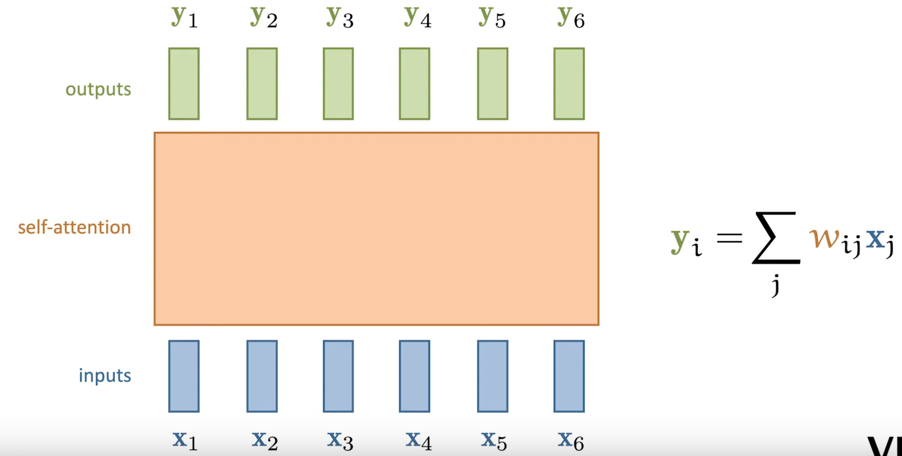
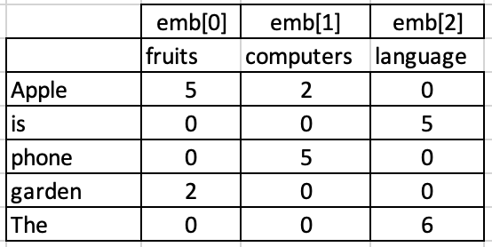
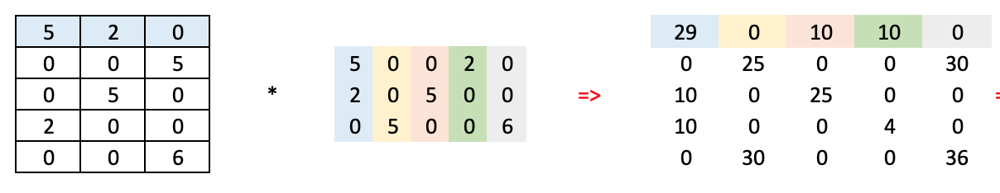
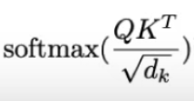
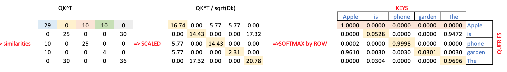
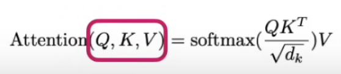
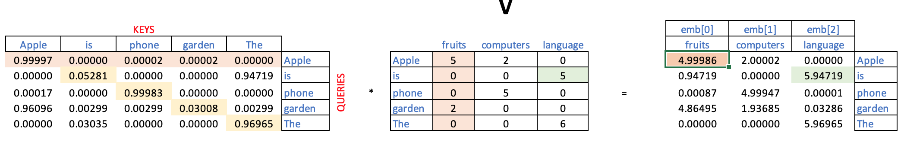
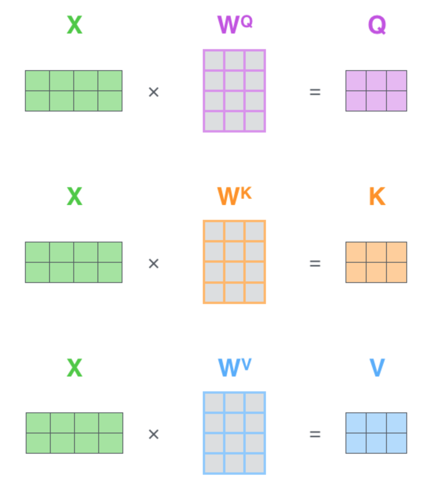

# Self-Attention mechanism for Transformers explained.

## Fixed Embeddings
Embedding is a widely known technique used to compress high-dimensional vectors of features into smaller, fixed-size vectors while preserving the relative distances between the original vectors.

I can iilustrate this concept by a short example from NLP domain. Lets imagine we need to compare two texts and say how simiar they are.

Before to that we need to convert the text into a vector of numbers. The common technic to represent a text as numbers in NLP is Bag Of Words (BofW). The idea behind that is to simply to count words in the text and then represent this text as one-dimensional vector which consists of vocabulary (list of all possible words) and approprite number close to each vocabulary position (count of particular word).

It is easy to imagine that the lenth of such vector might easily exceed 10000 or so (since potentially might be 10000+ english words), that makes operation on this vector not convinient, espesially taking into account that the vector might be extreemly sparse. On top of that each texts might have different number of words, so vector might potentially have different size which will make hard to calculate the distance.

The solution is to compress those vectors as follows 
- they need to be of a same size
- compress them into a much smaller size like 256 or 512
- we need to preserve the meaning of text, i.e. in term of similarotyes, all similarities between texts must be preserved

That operation of representing long vector with shorter one preserving the distances is called embedding and result in vectors of fixed size.

Multiple technics exists to create embeddings, for example
- Word2Vec
- Matrix Factorization
- GloVe
- etc

## Static vs context aware Embeddings

In reality embeddings are calculated not to the whole phrase but to each separate word in a phrase, so in a  phrase each word is substituted with its embeddings for futher manipulations.

Thus our pre-calculated embeddings have a major drawback, they do not account for phrase context, they are always the same.

For example in phrases
- An Apple is a fruit
- I bought a new Apply phone

The word Apple will be represented by have absolutelly the same embedding vector, for example Apple[5 0 0 2 0].

so once we have text and calculated embedding for every single word in a text they are fixed, we are not changing it. 

But as we can see in an example above the meaning of the word (Apple) might be different depending on the phrase context. 

It would be nice to have such an algorithm which will temporarily change word embeddings vectors, adjusting it to the context, i.e. to a phrase that word is used. 

## Self - Attention
Self-Attention is exactly mechanism to correct embeddings depending on a particular phrase context, i.e to account to context of where the word is used. As a result we wil have a embedding better reflecting the real meaning (apple phone vs apple fruit), and thus be better at the downstream tasks.

It is actually very similar to a way how we as human understand words in natural language, we have many word which have the same spelling but completelly different meaning and easily understand them right based on context .

We can schematically depict self-attention as follows.
Basically, we substitute our input embeddings X with adjusted embeddings Y.
New embeddings are derived from initial by summinng them with all the other embeddings but weithed by an "attention" coefficient. 

Attention is basically nothing more then a similarity between word in question and every other word.

For example if we have phrase "Apple is a fruit" the new adjusted embedding for an Apple will be

Apple = weight * Apple + weight * is + weight * fruit

of course the weight coeffisianrs will be calculated in such a way that Apple initial embeddings will still play a crucial role, but it still be adjusted to be close in space to a word which is important to understanding , in our case to fruit

It is impoortant to understant the key advantages of self-attention, which is the fact that that embedding correction is do not achived by expensive training but by simple matrix multiplication. So, no parameters for traning! That is important

## Example: Start from fixed Input word embeddings
Lets start from a sentence of 5 words.

Lets assume we already have embeddings for all these five words. They might be calculated by some methods above or even have a random initial values and supposed to be trained later. But out assumptions is that those embeddings already reflect some relationships between words, for example the similarity between apple and garden is higher then between apple and phone.

Now lets imagine that the length of these embeddings vectors is 3. 
So we have an embedding matrix like this

## K, Q: Calculate attention weights (Pairwise word similarities) for one phrase
The next step will be to understand dependencies between every word in our sentence. 

For example having a word Apple, what other word in our sentence is most similar in meaning to it? Well, it might be Phone or Fruit, so understanding the meaning of Apple we have to take a special attention to one of those words and much less attention to other words like THE or IS.

As we remember each word's embeddings are designed in a way the disctance between then reflects the acual meaning, so to understand dependencies we can calculate similariry. 

Since we have 5 words in our current sentence what we can do is to calculate pairwise similarities between all words.

The simpliest way to define a similarity is a dot-product. For example if we have three vectors,

a = [1  0 0]

b = [0 10 2]

c = [2  0 2]

It is obvios that according to dot product similarity the "a" vector is highly similar to itself

dot(a,a) = 1 * 1 + 0 * 0 + 0 * 0 = 1

"a" is more similar to "c then to "b" becuase "a" and "b" have a similar first feature 

dot(a,b) = 1 * 0 + 0 * 0 + 0 * 2 = 0

dot(a,c) = 1 * 2 + 0 * 0 + 0 * 2 = 2

A nice way to calculase all pairwise similarities in one operation is to multiply the embedding matrix by itself. 

In attention paradigm those two matrices are called **K (keys)** and **Q (queries)** but in fact they are the same matrices. 

So, we can nicely write this matrix multiplication as 

Q*K^T

or vizualize it as follows to have a pairwise similrity matrx among all words in our sentence

### Technical tricks: scaled and softmax normalized similarity

The dot-product similary has one drawback, it is havily influenced by absolute values of features and by length of embedding vector itself. 
To partially aleviate this issue a scaled dot-product is used.

Scaled dot product is nothing more them regular dot product but diveded by square root of length of embedding. So it becomes less dependent on length of embedding vector itself.

In our case we have embeddings of dimension 3 and the similarity between Apple and Apple are

(apple, apple) = (5 * 5 + 2 * 2 + 0 * 0) / sqrt(3) = 16.74

and much less between apple and phone

(apple, phone) = (5 * 0 + 2 * 5 + 0 * 0) / sqrt(3) = 5.77

Note that we divide it by square root of embedding dimensions length because embeddings are usually a pretty long vector, it might be 512 or 1024, so the dot product tends to be very large and we scale it down, simple make the absolute numbers smaller.

Another trick we would like to do with embedding vectors is to take a softmax on them, which essensially make the whole vector sum up to 1, i.e we normalize it. 

Also note that softmax is applied across each row, not column because
- in the attention mechanism, each word (or token) in the input sequence is "attending" to all other words.
- The row-wise softmax is done to normalize the attention weights for each query (which corresponds to each row) with respect to all the keys (corresponding to columns).
- This results in the attention scores across the key dimension summing to 1 for each query. Effectively, it means "how much attention" each query pays to all the other tokens in the sequence.

We can summarize all above in this matrix formula

or vizualize it 

Note that matrix is not symmetric in contrast to pairwise similarity matrix. 
The resulting matrix does not have to be symmetric. In fact, it often won’t be symmetric in the general attention mechanism because the relationship between words(tokens) is usually asymmetric. For example, one word might attend more to another than vice versa, depending on the context.

## V: Applying Attention and generate new embeddings adjusted to a phrase's meaning
So, what we have up to now
- a sentence
- initial embeddings for each word in this sentence
- similarity matrix for all words in the sentence (normalized and softmaxed). We can call it "attention" matrix because each row tells us how much attention (similarity) a word (Apple) has to all other words in the phrase.

Now we are going to adjust embedding of each word such that they reflect the fact that all those words are in the same phrase. i.e. if we have Apple and Phone in one phrase we have to move default meaning of Apple from fruits to Phones.

Lets recall our original embeddings for Apple : 

[ 5 (fruits), 2 (computers), 0 (language)]

So initially Apple has a s strong emphasise to fruits (5).

To adjust these "fruitish" weight to our phrase we calculate new fruit feature as follows:
- get how "fruit" were all words initially [5 0 0 2 0]
- weight them by "attention" of Apple to each other word in a sentence - [1 0 0 0 0]

For fruit feature:    dot([1 0 0 0 0], [5 0 0 2 0]) = 5

It essentially means that???

### Do that operation for an entire matrices: multiply Attention matrix by V
We can do this operation for the entire matrix at once. For that we multiply our pairwise similarity matrix on our initial embeddings matrix (now we call it V - values - but again it is essentially the same input embedding table).

As a result we have and adjusted embedding table and can use them futher in our transformer architecture.

Let's broke it down to numbers.

For Apple we have initial embeddings: [5 2 0]

We will calculate new adjusted embeddings as follows.

For fruit feature:    dot([1 0 0 0 0], [5 0 0 2 0]) = 5

For computer feature: dot([1 0 0 0 0], [2 0 5 0 0]) = 2

for language feature: dot([1 0 0 0 0], [0 5 0 0 6]) = 0

and so on.

In our case the values of features did not change due to poor initial embeddings choice, but in reality the new adjusted embeddings will slightly change and  reflect the sentence context better then our initial general embeddings.

The embeddings are adjusted according to how much attention they give to each other. For example, the word "is" now has a stronger association with the "language" embedding (since the value for that dimension has been amplified).

## Self-attention implementation
We do these embedding adjustments not by changing the original matrices of course, we attach weigths to  K Q V matrices, so 

Q = initial embeddings x Learnable Weights Q

K = initial embeddings x Learnable Weights K

V = initial embeddings x Learnable Weights V

# Conclusion
As a result of this operation we are able to adjust each word embeddings in a phrase to that particulare phrase meaning.

We do it by calculation a "self-attention" matrix so we can weith original embeddings bymultiplying by it.

Important note is that all those is done without training just by multiplygin matrices, who makes the futher training much less computationally intencive

## ----- TBD ------> Generate many different embeddings based on initial one
Apparently the actual meaning of the words (aka embedding) depending on a sentence (apple as a fruit and apple as a phone). 

But adjusting embeddings via training is very costly process. We might use some tricks and substitute adjusting the embeddings with training by generation new slightly modified embeddings via linear transformations such that it accounts for the sentence context somehow.

Namely we can use similarity information between all words (calculated above) to make these new embeddings somehow meaningful.

So, the idea behind this is as follows.
- We have an initial embedding for Apple 
- we can calculate new embedding for Apple as a sum of embeddings of all the other words in the sentence but weighed by the similarity of Apple with each of the word

For example, for Apple = [5 2 0] we can calculate a new embedding (based on a given sentence) as follows

new Apple embedding = 

  - Apple[5 2 0] * sim(Apple, Apple) + 
  - is[0 0 5] * sim(Apple, is) + 
  - phone[0 5 0] * sim(Apple, phone) + 
  - The[0 0 6] * sim(Apple, the) 
  
=

  - Apple[5 2 0] * 1 +
  - is[0 0 5] * 0 +
  - phone[0 5 0] * 0.0002 + 
  - The[0 0 6] * 0
= [5 2 0] + [0 0.001 0] = [5 2.001 0]

That operation will generate a new apple embedding which will encorporate information about all word in this sentence, saying for example that Apple is used in the same sentence with garden and phone.

