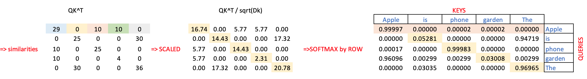

# Self-Attention mechanism for Transformers explained.

## Fixed Embeddings

Embedding is a well-known technique used to compress high-dimensional feature vectors into smaller, fixed-size vectors while preserving the relative distances between the original vectors.

To illustrate this concept, let's consider an example from the NLP domain. Suppose we need to compare two texts and determine how similar they are.

The first step is to convert the text into a numerical vector. A common technique for representing text as numbers in NLP is the Bag of Words (BoW) approach. The idea is simple: count the occurrences of each word in the text and represent the text as a one-dimensional vector, where each position corresponds to a word in the vocabulary (the list of all possible words), and the number in that position represents the word count in the given text.

It's easy to see that the length of such a vector can easily exceed 10,000, given that there are potentially over 10,000 words in the English language. This makes working with these vectors inconvenient, especially since they tend to be extremely sparse. Additionally, different texts may have varying lengths, resulting in vectors of different sizes, which makes calculating distances between them difficult.

The solution is to compress these vectors in the following way:
- Ensure they are of the same size.
- Compress them into a much smaller size, such as 256 or 512 dimensions.
- Preserve the meaning of the text, meaning all similarities between the texts must be retained.

This process of transforming long vectors into shorter ones while preserving the relative distances is called embedding, which results in vectors of fixed size.

Several techniques exist for creating embeddings, including:
- Word2Vec
- Matrix Factorization
- GloVe
- And others

## Static vs context aware Embeddings

In practice, embeddings are not calculated for the whole phrase but for each individual word within a phrase. So, in a given phrase, each word is replaced by its embedding for further manipulation.

However, these pre-calculated embeddings have a significant limitation: they do not account for the context of the phrase — they remain the same in all instances.

For example, consider the phrases:
- "An apple is a fruit."
- "I bought a new Apple phone."

In both cases, the word "Apple" will be represented by exactly the same embedding vector, for example, Apple[5, 0, 0, 2, 0].

Once we've generated embeddings for each word in a text, these embeddings are static and do not change.

But as the example above shows, the meaning of the word "Apple" can vary depending on the context.

It would be ideal to have an algorithm that can temporarily adjust the word embedding vectors to fit the context of the phrase in which the word is used. 

## Self - Attention

Self-Attention is the mechanism used to adjust embeddings based on the specific context of a phrase, allowing the meaning of a word to adapt according to where it is used. This results in embeddings that better capture the true meaning of a word (e.g., "Apple" as a phone versus "apple" as a fruit), improving performance in downstream tasks.

This process is quite similar to how humans understand words in natural language. Many words have the same spelling but completely different meanings, yet we easily interpret them correctly based on the context.

We can schematically represent self-attention as follows.

$$y_i = \sum_j w_{ij} x_j$$

Basically, we substitute our input embeddings X with adjusted embeddings Y.
New embeddings are derived from initial by summinng them with all the other embeddings but weithed by an "attention" coefficient. 

Essentially, we substitute our input embeddings $𝑋$ with new adjusted embeddings $𝑌$. 

In these new embeddings, each feature is now a sum of the same features for all other words in this phrase but weithed by a similarity of an original word and each other word. This weithing coefficient is called attention of the word to each other word.

Probably this consept os not quite clear yet, we will get back to it later again, but for now lets illustrate it by this example.

For a phrase "Apple is a fruit" the new adjusted embedding for an "Apple" will be

$$Apple = weight * Apple + weight * is + weight * fruit$$

Since the similarity of Apple with itself will always be close to one, the initial embedding will still play a major role, but similarity between Apple and fruite will also be quite high, we will shift apple embedding in our space a bit close to a fruit, so giving apple a bit more fruitness in this phrase only. In other phrases Apple might be shifted to phone for example or stay the same is there are no words significantly influencing Apple meaning.

It is also impoortant to understand that one more advantages of self-attention is the fact that that embedding correction is not achived by expensive training but by simple matrix multiplication. So, no parameters for traning! That weight are calculated by simple matrix multiplication, not based on training.

# Working Example
## Start from fixed Input word embeddings
Lets start from a sentence of 5 words.

Lets assume we already have embeddings for all these five words. They might be calculated by some methods above or even have a random initial values and supposed to be learned later. 

But our assumptions is that those embeddings already reflect some relationships between words, for example the similarity between apple and garden is higher then between apple and phone.

Now lets decide that the length of these embeddings vectors is 3, it means we have an embedding matrix like this

## K, Q: Calculate attention weights as pairwise word similarities for one phrase
The next step will be to understand dependencies between every word in our sentence. 

For example having a word Apple, what other word in our sentence is most similar in meaning to it? Well, it might be Phone or Fruit, so during understanding of Apple meaning we have to take a special attention to one of those words and less attention to other words like THE or IS, becasue they do not really chang the meaning of word APPLE.

As we remember each word's embeddings are learned in a way that the distance between them reflects the acual meaning, so calculation similariry between two words gives us an idea if two words are influencing each other, are situated in the same cluster of meanings. 

So, lets calculate all pairwise similarities between all our words in a given phrase.

The simpliest way to define a similarity is a dot-product. For example if we have three vectors,

$a = [1, 0, 0]$

$b = [0, 10, 2]$

$c = [2,  0, 2]$

According to dot product similarity the "a" vector is highly similar to itself, which completelly makes sence

$dot(a,a) = 1 * 1 + 0 * 0 + 0 * 0 = 1$

"a" is more similar to "c then to "b" becuase "a" and "b" have a similar first feature 

dot(a,b) = 1 * 0 + 0 * 0 + 0 * 2 = 0

dot(a,c) = 1 * 2 + 0 * 0 + 0 * 2 = 2

A nice way to calculase all pairwise similarities in one operation is to multiply the embedding matrix by itself. 

In attention paradigm those two matrices are called **K (keys)** and **Q (queries)** but in fact they are the same matrices. 

So, we can nicely write this matrix multiplication as 

$$Q*K^T$$

or vizualize it as follows to have a pairwise similrity matrix among all words in our sentence

### Technical tricks: scaled and softmax normalized similarity

The dot-product similary has one drawback, it is havily influenced by absolute values of features and by length of embedding vector itself. 
To partially aleviate this issue a scaled dot-product is used.

Scaled dot product is nothing more them regular dot product but diveded by square root of length of embedding. So it becomes less dependent on length of embedding vector itself.

In our case we have embeddings of dimension 3 and the similarity between Apple and Apple are

(apple, apple) = (5 * 5 + 2 * 2 + 0 * 0) / sqrt(3) = 16.74

and much less between apple and phone

(apple, phone) = (5 * 0 + 2 * 5 + 0 * 0) / sqrt(3) = 5.77

Note that we divide it by square root of embedding dimensions length because embeddings are usually a pretty long vector, it might be 512 or 1024, so the dot product tends to be very large and we scale it down, simple make the absolute numbers smaller.

Another trick we would like to do with embedding vectors is to take a softmax on them, which essensially make the whole vector sum up to 1 (along only one dimension!), i.e we normalize it along this dimestion. 

Softmax is applied across each row, not column because
- in the attention mechanism, each word (or token) in the input sequence is "attending" to all other words.
- The row-wise softmax is done to normalize the attention weights for each query (which corresponds to each row) with respect to all the keys (corresponding to columns).
- This results in the attention scores across the key dimension summing to 1 for each query. Effectively, it means "how much attention" each query pays to all the other tokens in the sequence.

We can summarize all above in this matrix formula

$\text{softmax}\left(\frac{QK^T}{\sqrt{d_k}}\right)
$

or vizualize it 

Note that matrix is not symmetric in contrast to pairwise similarity matrix. 
The resulting matrix does not have to be symmetric. In fact, it often won’t be symmetric in the general attention mechanism because the relationship between words(tokens) is usually asymmetric. For example, Apple is depends on Fruit, but Fruit does not depend of Apple to the same degree.

## V: Applying Attention and generate new embeddings adjusted to a phrase's meaning
So, what we have up to now
- a sentence of 5 words (apple is phone garden the)
- initial 3 dimensional embeddings for each word in this sentence
- similarity matrix for all words in the sentence (normalized and softmaxed). We can call this similarity as "attention"  because each row in matrix tells us how much attention (similarity) a word (Apple) has to all other words in the phrase.

Now we need to adjust embedding of each word such that they reflect the fact that all those words are in the same phrase. In other words if we have Apple and Phone in one phrase we have to move default meaning  of Apple (in embedding space) from Fruits to Phones.

How we can do that?

Let take a look on those two matrices. 

Initially, for Apple we have the following embeddings: 

[ 5 (fruits), 2 (computers), 0 (language)]

What we do next is the following
- Initial "fruitness" of Apple is 5. 
- see to which word in the sentence Apple is similar to. It is the first row of key/query matrix, [0.99997	0.00000	0.00002	0.00002	0.00000 ]
- Apple is mostly similar to itself (0.9997) and also a bit to Phone and garden.
- so we shift apple as a point in embedding space a bit close to Phone and Garden by having a dot product
-  [0.99997	0.00000	0.00002	0.00002	0.00000 ]  dot  [5 0 0 2 0] = 4.99986

Note that initial fruitness is still very close to 5, but we also added a small contribution of Garden fuitness and phone fruitness, so shifted a little bit Apple point to the clusters of garden and phones.

As it was mentioned at the very begining, we do it by summing up the initial embedding of Apple with all other embedding in the phrase wighted by similarity. So if it happens that in our current phrase there is a word with hight similarity (fruit, phone) it will pull the embedding of an Appe to itself, making it closer to a cluster of fruits or phone. 

### Do that operation for an entire matrices: multiply Attention matrix by V
We can do this operation for the entire matrices at once. For that we multiply our pairwise similarity matrix on our initial embeddings matrix (now we call it V - values - but again it is essentially the same input embedding table).

$$\text{Attention}(Q, K, V) = \text{softmax}\left(\frac{QK^T}{\sqrt{d_k}}\right)V$$

As a result we have and adjusted embedding table and can use them futher down in our transformer architecture.

Let's broke it down all numbers.

The embeddings are adjusted according to how much attention they give to each other. For example, the word "is" now has a stronger association with the "language" embedding (since the value for that dimension has been amplified).

# Conclusion
As a result of this operation we are able to adjust each word embeddings in a phrase to that particulare phrase meaning.

We do it by calculation a "self-attention" matrix so we can weith original embeddings bymultiplying by it.

Important note is that all those is done without training just by multiplygin matrices, who makes the futher training much less computationally intencive

