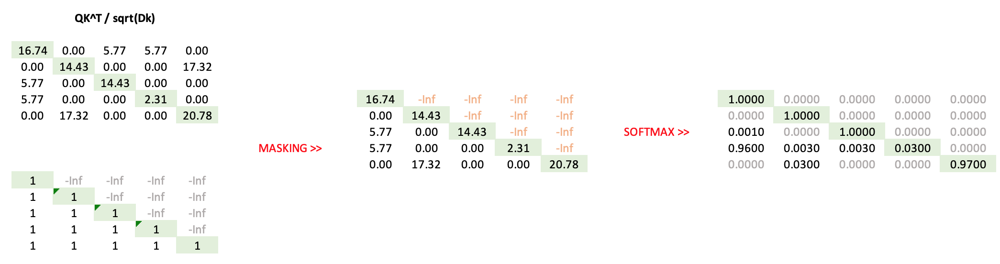

# Masked Attention implementation

From the previous post we can remember that we adjust each word embedding to a phrase content by 
- first, calculation pairwise similarity between all words in a phrase
- scaling and normalizing it by dividing and softmaxing
- modify each feature (aka coordinate) by summing all word coordinates weithed by its similarity to a given word

That is all right, with one nuance. 
One way of foundational model training in generative settings is about to predict next token based on previous tokens, but if we modify embeddings based on all words in a sentence we kind of violate this idea. So, to be consistent at every time step we have to mask all future tokens from any similarity etc calculations, so, predicting next token we have  to only relay on the past tokens.

Here we show how to do it in computationally efficient way.

- **pairwise matrix**: First of all we need to compute pairwise dot-product similarity matrix as usial, but do not softmax it
- **create lower triangular matrix**: Create a lower triangular matrix, so later on we can use it to mask future token
- **do masking**
- **take final softmax**

