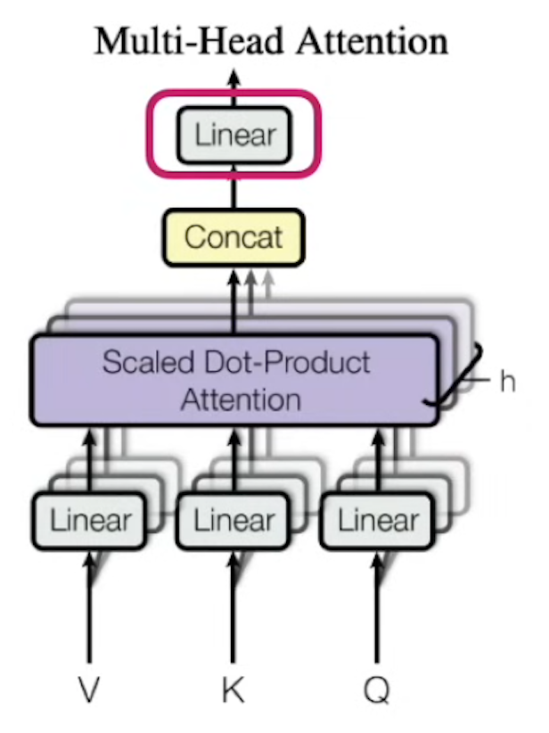
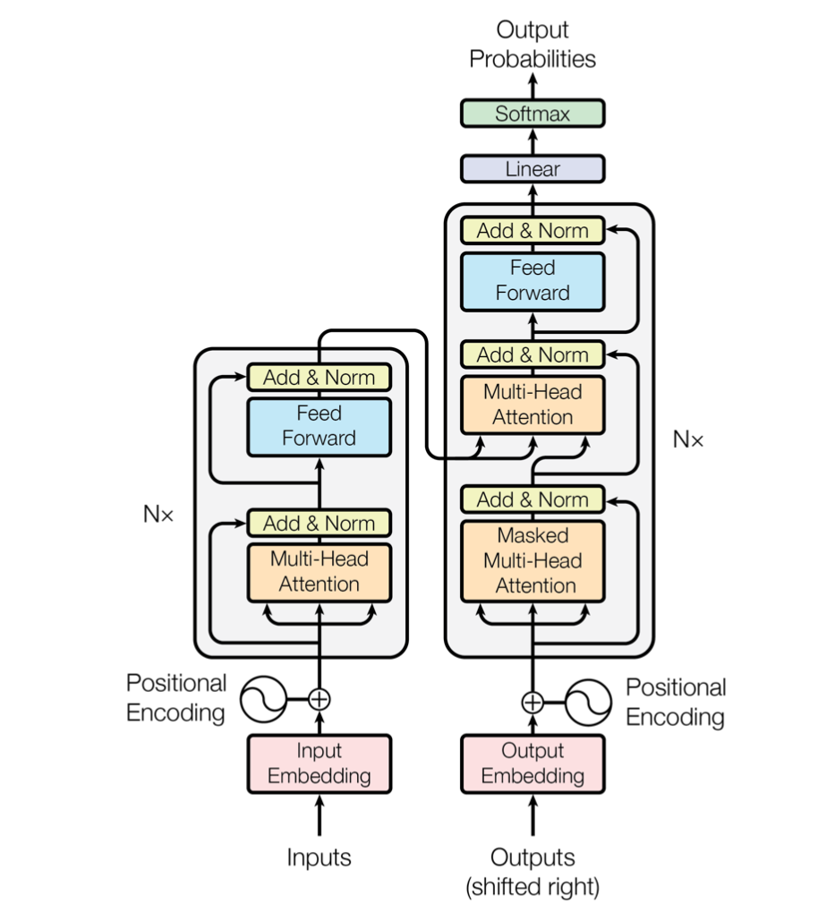

# Transformer architecture

## Multi-Head Attention
разница между self-attention and multihead attention в том что

- мы используем много матриц K, Q and V а потом concatenate результаты от каждого head - то есть вытягиваем в линию - используем всех
- но потом используем Linear layer чтобы сжать размерность в исходную

## Attention is all you need Transformer architecture

## Relation to a transformer training and inference
Lets understand how embeddings and self-attention adjustments work across sentences, especially in the context of training a Transformer.

It is important to understand that when you apply self-attention and adjust the embeddings for a particular sentence, this adjustment is only temporary for that specific forward pass

- Input Embeddings: At the start, every word (or token) in your sentence is converted into a vector representation (embedding). These embeddings are static; they are a fixed part of the model's learned parameters after training. For example, in a trained model, the embedding for "Apple" or "phone" is constant across all sentences.

- Self-Attention Mechanism: During the forward pass of a Transformer, the self-attention mechanism dynamically adjusts these embeddings based on the relationships (similarity or attention) between words in the sentence only during that pass.

So, the adjustments you make using self-attention (the values you compute after multiplying the softmax scores with the value matrix 𝑉 are specific to that sentence and do not carry over to the next sentence.

### Attention and Transformer training
- Embeddings are learned: The embeddings themselves are learned during training. Each word or token in the vocabulary has an associated embedding vector that is updated by backpropagation. The idea is that words or tokens with similar meanings (based on the training data) will have embeddings that are close to each other in the vector space.

- Self-Attention Mechanism: The self-attention mechanism learns the best way to weight relationships between words in a sentence. During the forward pass, the attention mechanism computes pairwise relationships between words and adjusts their embeddings based on these relationships.

- Forgetting Adjustments: Once the forward pass is done and the loss is computed, the specific adjustments made for that sentence during self-attention are forgotten. The only thing that persists are the learned parameters (such as embeddings and attention weights) which get updated after backpropagation.

### Attention and inference
Once the model is trained:

- The learned embeddings (which have been optimized during training) are static and are not modified during inference.
- For each new sentence, the self-attention mechanism dynamically adjusts the embeddings temporarily based on the sentence structure, computes the output (such as predicted next word, classification, etc.), and then moves on to the next sentence.

