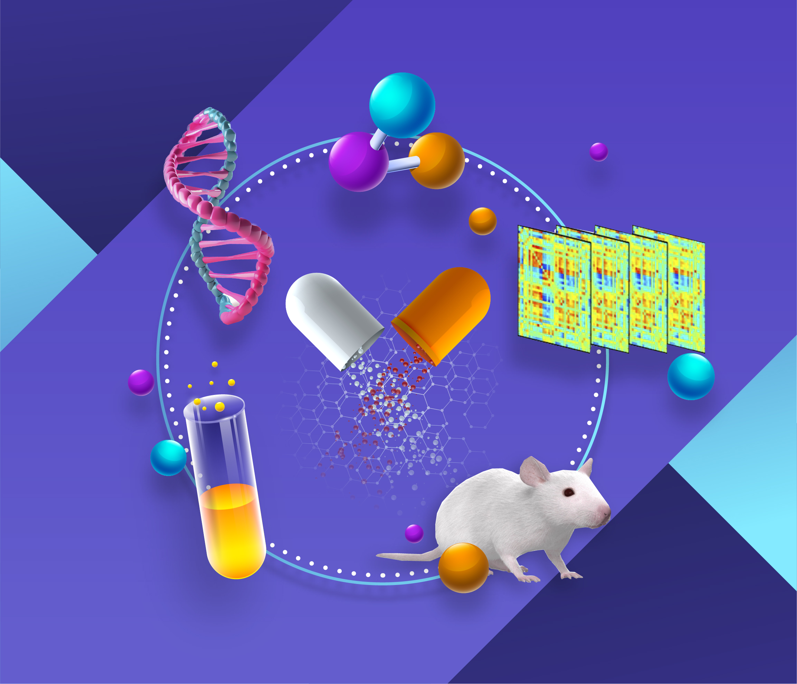

# Modern Drug Development Process and Artificial Intelligence (AI)

## The drug discovery process
Historically finding new medications to help cure diseases was originally driven either by chance or by the efforts of a single individual/lab who truly believed in their mission and dedicated a significant part of their life to finding a new drug. The discovery of novel drugs was rare, and these drugs often suffered from unexpected side effects or questionable effectiveness.

Two major advancements changed the landscape. First, modern clinical trials, particularly double-blind and placebo-controlled studies, were developed to rigorously prove effectiveness and measure side effects. Second, high-throughput screening (HTS) transformed the process of discovering new chemicals from a random endeavor into a systematic one.

Today, there are two broad categories of drugs:
- Small molecules (commonly referred to as drugs), which are synthesized by pharmaceutical companies.
- Large molecules or biologics, which are typically proteins or other biological macromolecules. These are not synthesized chemically but are produced by living cells—such as bacterial, yeast, or mammalian cells—by biotechnology companies.

The development of a market-ready drug usually takes up to 10 years and can cost up to a billion dollars.

Recently, significant efforts have been made by many companies to incorporate Artificial Intelligence (AI) techniques into the drug discovery process at various stages, with the goal of making it faster and more cost-effective.

It is also important to distinguish between the discovery of novel drugs and drug repurposing. The latter is usually much less expensive because the drug is simply repurposed for a new indication or dosage or packaging, allowing the company to skip the preclinical development stage and the Clinical Phase I safety stage altogether.

Modern Drug Development Cycle consists of three major stages
- Drug Discovery
- Preclinical development
- Clinical development

## I: Drug discovery stage
Drug is never exists in isolation, so finding a drug essentially means finding a tripple disease-target-drug.

In general. on a drug dicovery stage a drug discovery team must come up with several candidate triples **disease-target-drug** which then shall be hanged over to pre-clinical team for much more expensive developmnt.

### Disease
For a drug discovery company choosing one or several diseases (condition, indication) to cure is usually a starting point. The company first decide to find a drug for lung cancer for example and then go next to target discovery and drug itself.

For a drug-repurposing company it might be other way round. Since they are trying to re-purpose the existing drug they might start from a drug then go back to find a target affected by this drug and then proceed to another disease, that is an idea behind repurposing.

### Target
After pinpointing the disease a target must be selected and that is where the real discovery process has actually started. 
Target is usually a protein or a gene, which might be targeted to affect biological process in a needed way. 
One might deside to look for completelly novel target or choose several existing targets from target databases and then try to find a novel drug for that target. 
Both of these method can be heavily augmented by artificial inteligence method, we will write about concrete methods in our futher posts.

### Drug 
Finding a drug started from a so-called Hit identification, i.e. finding a chemical compounds (referred to as "hits") that interact with the target identified in the previous step. 
Binding or activity might not be strong or sufficient enough, so a next step, called **lead optimization** is nessesary. At this step Optimization of Activity, Reduction of Toxicity and Improvement of Drug-Like Properties might be performed.

Again, this is a step where AI can help a lot.

At the end of drug discovery process we have at least one **LEAD**,  a tripple of disease-target-drug which potentially can affect disease in a needed way.
But all those conclusions so far were done outside of real biological systems, at cell line level, now the next step would be to check if it works on biological non-human models: mises etc.

## II: Preclinical development
At the begining of this stage we have at least one lead molecule which affect a disease by interacting with target.

Preclinical testing is mainly about **efficacy and safety (toxicity)**.
It includes **in-vitro testing** and **in-vivo** testing on animal models, i.e. usually mices with induced disease-like conditions.

Preclinical testing is mandatory, without it a regulatory authorities (FDA, etc) wont issue a permission to test it on humans.

Preclinical testing usually includes:
- **PK - pharmacokinetics**: the study of how a drug moves through the body over time, i.e. defining ADME profile (Absorption, Distribution, Metabolism, Excretion). On this stage different characteristics of the drug have been experimentally elucidated, like Concentration-Time Profile, The highest concentration etc
- **PD - pharmacodynamics**: 

