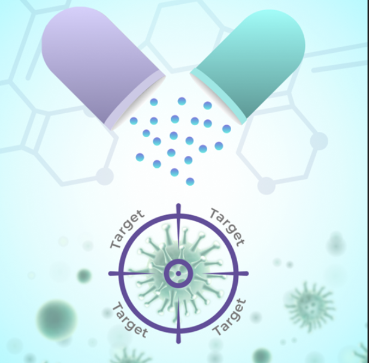

# Modern Drug Development Process in Brief

## The Drug Discovery Process

Historically, the search for new medications to treat diseases was driven either by chance or by the dedication of individuals or small labs who passionately believed in their mission and spent significant parts of their lives working toward discovering a new drug. Novel drug discoveries were rare, and these drugs often faced issues like unexpected side effects or questionable effectiveness.

Two major advancements have since transformed the landscape. First, the development of modern clinical trials, particularly double-blind and placebo-controlled studies, provided a rigorous way to prove a drug's effectiveness and measure its side effects. Second, high-throughput screening (HTS) shifted the process of discovering new chemicals from a random, hit-or-miss endeavor to a systematic and methodical process.

Today, drugs are broadly categorized into two types:
- Small molecules (commonly referred to as drugs): These are simple chemical compounds synthesized by pharmaceutical companies.
- Large molecules or biologics: Typically proteins or other biological macromolecules, biologics are not synthesized chemically but are produced by living cells—such as bacterial, yeast, or mammalian cells—by biotechnology companies.

The development of a market-ready drug typically takes up to 10 years and can cost up to a billion dollars.

Recently, significant efforts have been made by many companies to integrate Artificial Intelligence (AI) techniques into various stages of the drug discovery process, aiming to make it faster and more cost-effective.

It's also important to distinguish between the discovery of novel drugs and drug repurposing. Drug repurposing is usually much less expensive because it involves adapting an existing drug for a new indication, dosage, or packaging, allowing companies to bypass the preclinical development stage and Clinical Phase I safety trials.

The modern drug development cycle consists of three major stages:
- Drug Discovery
- Preclinical development
- Clinical development

## Stage 1: Drug Discovery
A drug never exists in isolation; finding a drug essentially means discovering a triple combination of disease-target-drug.

During the drug discovery stage, the team must identify several candidate triples (**disease-target-drug**) that will later be handed over to the preclinical team for more expensive testing. The better the work done at this stage, the less money will be spent in the preclinical phase to rule out unsuitable candidates.

### Disease
For a drug discovery company, choosing one or more diseases (also referred to as conditions or indications) to target is usually the starting point. For example, a company might first decide to find a drug for lung cancer and then proceed to target discovery and eventually to drug identification.

For a drug repurposing company, the process may work the other way around. Since they are trying to repurpose an existing drug, they might start with the drug, then identify the target it affects, and finally consider another disease that could be treated by this drug. This is the core idea behind drug repurposing.

### Target
After pinpointing the disease, the next step is to select a target—this is where the true discovery process begins. The target is usually a protein or gene that can be influenced to affect a biological process in the desired way.

Researchers may choose to investigate completely novel targets or select from existing ones in target databases and then attempt to discover a new drug for that target. Both approaches can be significantly enhanced by artificial intelligence methods, which we'll discuss in more detail in future posts.

Target discovery is a large topic in itself and will be covered more thoroughly in a subsequent article.

### Drug 

Finding a drug begins with **hit identification**, which involves discovering chemical compounds (referred to as "hits") that interact with the target identified in the previous step.

However, the initial binding or activity might not be strong or sufficient, so the next step, called lead optimization, is necessary. During this stage, researchers focus on optimizing activity, reducing toxicity, and improving drug-like properties.

Again, this is an area where AI can make a significant impact, and we will address this in more detail in future articles.

At the end of the drug discovery process, we should have at least one **LEAD**, a triple combination of disease-target-drug that has the potential to affect the disease as needed. However, all conclusions drawn thus far have been made outside of real biological systems—at the cell line level or even in silico. The next step is to verify these findings in real-life settings, using animal models and other methods.

## Stage 2: Preclinical Testing
At the beginning of this stage, we have at least one lead molecule that affects a disease by interacting with its target.

Preclinical testing is primarily focused on **efficacy and safety (toxicity)**. This stage involves both **in vitro** testing (performed in cells outside of a living organism) and **in vivo** testing (conducted on animal models, typically mice with induced disease-like conditions).

Preclinical testing is mandatory; without it, regulatory authorities (such as the FDA) will not grant permission to proceed to human trials.

By the end of the drug discovery stage, we have one or several candidate disease-target-drug combinations. The goal of preclinical testing is to demonstrate that these candidates are effective and safe enough to justify testing in humans.

Thus, preclinical testing is crucial for assessing efficacy and safety (toxicity). It encompasses **in vitro** and **in vivo** testing, with the latter typically performed on animal models that mimic the disease conditions.

Preclinical testing is not optional; regulatory authorities like the FDA require it before a drug can be tested in humans.

The culmination of preclinical testing is the submission of an **Investigational New Drug (IND)** application.

The IND application consists of three key parts:
- **Formulation development**: Describes the best method to prepare the drug during the preclinical phase for its intended clinical use in patients later on.
- **Pharmacology** (in animals):
    - **PK (pharmacokinetics)** and ADME (Absorption, Distribution, Metabolism, Excretion).
    - **PD (pharmacodynamics)** and safety assessments.
- **Toxicology**: These studies examine the effects of longer-term drug exposure on the body, including repeat-dose studies.

### Pharmacokinetics

**Pharmacokinetics (PK)** refers to the study of how a drug moves through the body over time (what the body does to a drug). 

PK is typically divided into four key stages, summarized by the acronym ADME:
- **Absorption**: How the drug enters the bloodstream after administration. Administration might be done as oral, intravenous (injected directly into the bloodstream), or topical (applied to the skin) and absorption heavily depends on this route of administration.
- **Distribution**: This stage determines how much of the drug reaches the target site where it will have its intended effect.
- **Metabolism**: Metabolism typically transforms the drug into more water-soluble compounds that can be more easily excreted from the body. 
- **Excretion**: The process of eliminating the drug from the body, primarily through the kidneys (urine) or the liver (bile/feces). This stage determines how long the drug stays in the body and continues to have an effect.

The typical quantitative outcomes of these studies include measures such as the concentration-time curve, Cmax (Maximum Concentration): the highest concentration of the drug observed in the blood after administration; Tmax (Time to Maximum Concentration), and AUC (Area Under the Curve), which represents the total drug exposure over time; many others

### Pharmacodynamics

**Pharmacodynamics (PD)** focuses on understanding the effects of a drug on the body, what drug does to a body. More precisely, it is the relationship between drug concentration and its biological or therapeutic effects. 

It is done by more detailed understanding of the **Mechanism of Action (MoA)**: how the drug interacts with its biological target (e.g., receptors, enzymes). It usually requires revisiting primary target interactions as well as Identification  Off-Targets (additional proteins or receptors the drug interacts with, which could lead to side effects)

In quantitativy terms evaluating **Drug Potency and Efficacy** and Establish the **Effective Dose Range**
means elusidating IC50/EC50 Values (Concentration of the drug required to inhibit or activate 50% of its target - measure of drug potency) and quantitative data on the relationship between drug concentration and the magnitude of its effect, usually as 2D plot.

Once again, the outcome of the preclinical stage is the submission of an Investigational New Drug (IND) application.

# Stage 3: Clinical Testing

Any drug development company must complete an **Investigational New Drug (IND)** application based on their preclinical testing and submit it to the appropriate regulatory body (such as the FDA) in order to begin clinical trials.

In the UK, the regulatory body is the Medicines and Healthcare Products Regulatory Agency (MHRA); in the USA, it is the Food and Drug Administration (FDA); and in Europe, it is the European Medicines Agency (EMA).

Clinical trial phase might only be started after the IND is approved. Approval depends on the results of preclinical testing and if they are satisfactory to the regulatory authority.

Clinical trials are generally conducted in three phases:

**Phase I: Testing on Healthy Volunteers for Safety**
The goal is to determine the highest dose of a drug that can be safely administered to humans without serious side effects. The outcome of this phase is the establishment of a safe dosage range and the identification of any potential side effects. This phase is crucial for determining how the drug can be administered safely in subsequent phases.

**Phase II: Testing Effectiveness in Patients with the Disease**
This phase aims to assess the drug’s efficacy, typically involving 100-300 patients who have the disease or condition that the drug is intended to treat. These are the most rigorous trials, often using single-blind (where the patient does not know if they are receiving the drug or a placebo) or double-blind (where neither the patient nor the doctor knows) designs. A challenge in this phase is recruiting enough patients, particularly for rare diseases. Successful Phase II trials demonstrate that the drug has a therapeutic effect, justifying further testing in larger populations.

**Phase III: Efficacy in a Large Patient Population**
In this phase, the drug is tested in a much larger and more diverse patient population. Researchers compare the new drug to existing standard treatments or placebos to determine its relative efficacy. If Phase III trials are successful, the data are used to submit a **New Drug Application (NDA)** or **Biologics License Application (BLA)** to regulatory agencies. If the application is approved, the drug is approved for market release and sales.

**Phase IV: Launch and Post-Marketing Surveillance**
At this stage, the drug is already on the market and being used in real-world settings (RWS). Ongoing surveillance continues to monitor the drug for any additional side effects or issues that may not have been evident during earlier trials. Phase IV is crucial for ensuring the drug remains safe and effective over the long term.

